# Learning Playwright Fundamentals 3x

Hands-on Playwright + TypeScript practice repo used in **The Testing Academy** Playwright Fundamentals batch.
Everything here is beginner friendly: install Playwright, run the sample tests, record your own tests with codegen, and read the HTML report.

> Maintained by [Pramod Dutta](https://github.com/PramodDutta) · [The Testing Academy](https://thetestingacademy.com)

---

## Playwright architecture

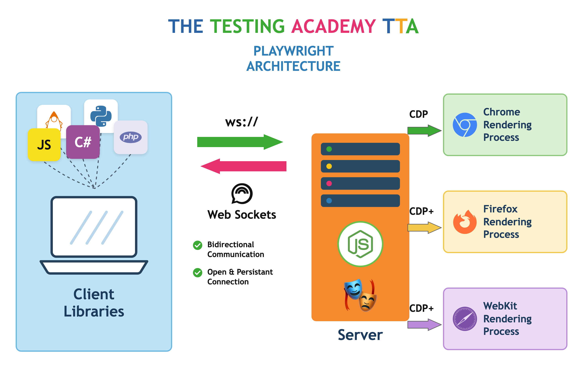

Playwright is a **client-server** tool. Understanding the three tiers explains most of its behaviour:

1. **Client libraries** - your test code. Playwright supports JavaScript/TypeScript natively and ships bindings for Java, Python, C# and (community) PHP. Every binding talks the same wire protocol, so the API is nearly identical across languages.
2. **WebSocket connection (`ws://`)** - the client opens a single, persistent, bidirectional connection to the Playwright server and keeps it open for the whole session. One connection carries every command and every event, which is why Playwright is fast and why it can stream events (console logs, network, dialogs) back to your test in real time. Contrast this with tools that open a new HTTP request per command.
3. **Node.js server** - the driver process. It translates your API calls into browser protocol messages, and it runs on Node even when your tests are written in Python or Java.
4. **Browser rendering processes** - the server speaks **CDP** (Chrome DevTools Protocol) to Chromium, and a **patched/extended protocol (CDP+)** to the Playwright builds of Firefox and WebKit. This is why Playwright ships its own browser binaries: the Firefox and WebKit builds carry patches that expose a CDP-like surface.

**Why this matters when you write tests**

| Architecture fact | What you get |
|---|---|
| One persistent WebSocket | Fast execution, no per-command HTTP overhead |
| Server streams events back | Auto-waiting, `page.on('request')`, dialog handling, tracing |
| Server owns the browser | Parallel isolated `BrowserContext`s instead of full browser restarts |
| Patched Firefox/WebKit | Same API across all three engines, hence `npx playwright install` |

---

## 1. Prerequisites

| Tool | Version | Check with |
|------|---------|-----------|
| Node.js | 18 or higher (20+ recommended) | `node -v` |
| npm | comes with Node | `npm -v` |
| VS Code | latest (optional but recommended) | - |
| Git | latest | `git --version` |

Download Node.js from https://nodejs.org (pick the LTS build).

---

## 2. Clone and install

```bash
git clone https://github.com/PramodDutta/LearningPlaywrightFundamentals3x.git
cd LearningPlaywrightFundamentals3x

# install project dependencies (@playwright/test, @types/node)
npm install

# download the browser binaries Playwright drives (Chromium, Firefox, WebKit)
npx playwright install
```

On Linux you may also need the OS libraries:

```bash
npx playwright install --with-deps
```

Only need one browser? `npx playwright install chromium`

---

## 3. Setting up a Playwright project from scratch

If you want to build this project yourself instead of cloning, this is the exact flow:

```bash
mkdir LearningPlaywrightFundamentals3x
cd LearningPlaywrightFundamentals3x

npm init -y
npm init playwright@latest
```

The installer asks four questions. Answers used in this repo:

| Question | Answer |
|----------|--------|
| TypeScript or JavaScript? | **TypeScript** |
| Where to put your end-to-end tests? | **tests** |
| Add a GitHub Actions workflow? | your choice (`false` here) |
| Install Playwright browsers? | **true** |

It scaffolds:

```
playwright.config.ts     # all Playwright settings
tests/example.spec.ts    # first sample test
package.json             # scripts + devDependencies
.gitignore
```

Manual alternative (what `npm init playwright` does under the hood):

```bash
npm i -D @playwright/test @types/node
npx playwright install
```

---

## 4. Project structure

```
LearningPlaywrightFundamentals3x/
├── tests/                     # numbered curriculum, one folder per topic (see section 5)
│   ├── 01_Basics/
│   │   ├── 216_example.spec.ts       # title assertions on playwright.dev (viewer + admin)
│   │   ├── 217_multiple_context.ts   # two isolated sessions in one browser
│   │   ├── 218_normal_pw.ts          # raw library script: Browser -> Context -> Page
│   │   ├── 219_tta-check.spec.ts     # login flow on the TTA practice site (codegen)
│   │   ├── 220_BCP.spec.ts           # the three-level hierarchy, logged step by step
│   │   ├── 221_TA.spec.ts            # three role contexts via the browser fixture
│   │   └── 222_Test_Options.spec.ts  # viewport, locale, timezone, geolocation, mobile
│   ├── 02_TestAnnotations/
│   │   ├── 223_TestAnnotations.spec.ts  # skip, only, fail, fixme, slow
│   │   └── 224_TestDescribe.spec.ts     # grouping tests with describe
│   ├── 03_Locator_Commands/
│   │   ├── 225_LC.spec.ts            # goto options: waitUntil, timeout, referer
│   │   ├── 226_Refere.spec.ts        # context-wide referer via extraHTTPHeaders
│   │   ├── 227_Fresh.spec.ts         # CSS selectors on the VWO login form
│   │   ├── 228_Project3.spec.ts      # XPath, strict mode and .first()
│   │   ├── 229_getByRole.spec.ts     # role locators on the VWO login form
│   │   └── 230_getByRole.spec.ts     # role locators, link vs button
│   ├── 04_Session_Storage/
│   │   ├── 231_SessionStorage.ts     # log in once, save cookies + localStorage
│   │   └── 232_TestWingify.spec.ts   # three tests reusing the saved session
│   ├── 05_Allure_Reporting/
│   │   ├── 233_Custom_Report_TestWingify.spec.ts  # run against the custom reporter
│   │   └── 234_Media_Custom_Report.spec.ts        # screenshot + video + trace
│   ├── 06_Multiple_Element_Filter/
│   │   ├── 235_ME.spec.ts            # allInnerTexts, then act on a match
│   │   └── 236_ME.spec.ts            # all() -> Locator[], read href per link
│   ├── 07_WebTables/
│   │   ├── 237_TestCase.spec.ts      # row loop, cells via allInnerTexts
│   │   ├── 238_TestCase.spec.ts      # dynamic XPath + following-sibling
│   │   ├── 239_TestCase.spec.ts      # filter({ hasText }) on a link list
│   │   ├── 240_TestCase.spec.ts      # tr:has(td:text()) row selection
│   │   ├── 241_WebTable_Pagination.spec.ts   # page-by-page search, inline
│   │   └── 242_WebTable_Pagination.spec.ts   # same search as a helper
│   └── 08_.. 23_/             # remaining topics, see the curriculum table
├── template/template.spec.ts  # starting skeleton for a new spec
├── ai/                        # RCA + flaky-analysis agents used by the reporter
├── utils/CustomReporter.ts    # custom HTML reporter (TTA branded)
├── docs/images/               # architecture diagram (png + html source)
├── playwright.config.ts       # testDir, reporter, trace, headless, projects
├── package.json
├── .env.example               # copy to .env and fill in credentials
├── tta-report/                # custom reporter output (git ignored)
├── allure-results/            # allure raw results (git ignored)
├── playwright-report/         # generated HTML report (git ignored)
├── test-results/              # traces, screenshots, videos (git ignored)
└── README.md
```

---

## 5. The curriculum: how `tests/` is organised

**Concept:** The `tests/` folder is a numbered syllabus, not a flat dump. Each folder is one topic, in the order it is taught, and specs inside carry a running lesson number (`225_LC.spec.ts`) so a file always maps back to the class it came from.

**Why:** A flat `tests/` folder stops being navigable at about fifteen files; numbered topic folders let you jump straight to the lesson you are revising and let the runner target one topic with a path filter.

**Q&A - why use this?**
- **Q: Do I need to change `playwright.config.ts` for nested folders?** A: No. `testDir: './tests'` recurses into every subfolder automatically, so specs are discovered at any depth.
- **Q: Why keep `.gitkeep` files in the empty folders?** A: Git tracks files, not directories. Without a placeholder, an empty topic folder simply would not exist for anyone who clones the repo.
- **Q: How do I run just one topic?** A: Pass the folder as a path filter: `npx playwright test tests/02_TestAnnotations`. Everything else is skipped.

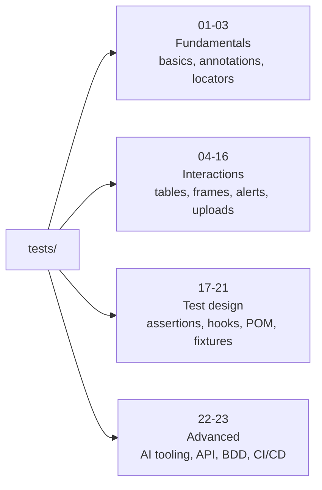

| # | Topic | # | Topic |
|---|---|---|---|
| 01 | Basics | 13 | Shadow DOM |
| 02 | Test Annotations | 14 | File Upload |
| 03 | Locator Commands | 15 | File Download |
| 04 | Session Storage | 16 | Scroll to Element |
| 05 | Allure Reporting | 17 | Expect Assertions |
| 06 | Multiple Element Filter | 18 | Test Hooks |
| 07 | WebTables | 19 | Data Driven Testing |
| 08 | Web Select, Frames, Iframe | 20 | Page Object Model |
| 09 | Frame / Iframe | 21 | Fixture |
| 10 | Keyboard, Hover, Drag Drop, Calendar | 22 | Misc AI Concepts |
| 11 | JS Alerts | 23 | Advance PW Framework |
| 12 | Handle SVG | | |

The last two folders branch further:

```
22_Misc_AI_Concepts/          23_Advance_PW_Framework/
├── 01_Playwright_MCP         ├── 01_API_Testing
├── 02_Playwright_CLI         ├── 02_Cucumber BDD
├── 03_Playwright_AI_Agents   ├── 03_AI_Agent Factory
├── 04_Selenium_To_PW_Migration  └── 04_CI_CD
└── 05_SKILL_PW_36                  ├── Github Actions
                                    └── Jenkins
```

---

## 6. Running the tests

```bash
# run everything
npx playwright test

# run a single file
npx playwright test tests/01_Basics/219_tta-check.spec.ts

# run one test by title
npx playwright test -g "admin"

# headed mode (watch the browser)
npx playwright test --headed

# UI mode: the best way to learn, time travel + watch mode
npx playwright test --ui

# debug mode with the Playwright Inspector
npx playwright test --debug

# pick a browser project
npx playwright test --project=chromium

# run serially, useful while debugging
npx playwright test --workers=1

# run one topic folder from the curriculum
npx playwright test tests/02_TestAnnotations
```

The two library scripts in `01_Basics/` are not specs, so the runner skips them. Run those directly:

```bash
npx tsx tests/01_Basics/218_normal_pw.ts
npx tsx tests/01_Basics/217_multiple_context.ts
npx tsx tests/04_Session_Storage/231_SessionStorage.ts   # saves user-session.json
```

### Starting a new test

`template/template.spec.ts` is the skeleton every lesson starts from. Copy it, change the title and the URL, and write the body where the `// Code` marker sits:

```ts
import { test, expect, Locator } from '@playwright/test';

test('Verify the TestCase', async ({ page }) => {
   await page.goto("https://app.thetestingacademy.com/playwright/multiple_element_filter");

    // Code

   await page.pause();
});
```

`page.pause()` opens the Inspector so you can step through and pick locators while writing. Remove it before committing, it halts the run.

Run a file against the custom reporter instead of the configured ones:

```bash
npx playwright test tests/05_Allure_Reporting/234_Media_Custom_Report.spec.ts \
    --reporter=./utils/CustomReporter.ts
```

Open the report after a run:

```bash
npx playwright show-report
```

These npm scripts are already wired up in `package.json`:

```bash
npm test            # playwright test
npm run test:headed # playwright test --headed
npm run test:ui     # playwright test --ui
npm run test:debug  # playwright test --debug
npm run report      # playwright show-report
npm run codegen     # playwright codegen
```

---

## 7. Codegen: record tests instead of writing them

Codegen opens a browser, watches what you click and type, and writes the Playwright code for you. It prefers user-facing locators (`getByRole`, `getByLabel`, `getByTestId`) over brittle CSS/XPath.

### Basic recording

```bash
npx playwright codegen
```

### Record starting at a URL

```bash
npx playwright codegen https://app.thetestingacademy.com/playwright/multiple_element_filter
```

### Save the recording straight into a spec file

```bash
npx playwright codegen --target=javascript -o tests/new-test.spec.ts https://playwright.dev
```

For TypeScript output:

```bash
npx playwright codegen --target=playwright-test -o tests/new-test.spec.ts https://playwright.dev
```

### Useful codegen flags

| Flag | What it does |
|------|--------------|
| `-o, --output <file>` | write the generated code to a file |
| `--target=<lang>` | `playwright-test`, `javascript`, `python`, `java`, `csharp` |
| `-b, --browser <name>` | `chromium` (default), `firefox`, `webkit` |
| `--device="iPhone 13"` | emulate a mobile device |
| `--viewport-size=1280,720` | set the window size |
| `--color-scheme=dark` | record in dark mode |
| `--timezone="Asia/Kolkata"` | set the timezone |
| `--geolocation="28.6139,77.2090"` | set coordinates |
| `--save-storage=auth.json` | save cookies + localStorage after login |
| `--load-storage=auth.json` | start already logged in |
| `--ignore-https-errors` | skip certificate warnings |

### Record a logged-in session (very common)

```bash
# 1. log in manually, then close the browser. state is saved.
npx playwright codegen --save-storage=playwright/.auth/user.json https://example.com/login

# 2. reuse that session for the next recording, no login steps needed
npx playwright codegen --load-storage=playwright/.auth/user.json https://example.com/dashboard
```

### Codegen toolbar

While recording you get a small toolbar with three modes:

- **Record** - captures your actions as code
- **Pick locator** - hover any element and copy its best locator
- **Assert visibility / text / value** - generate `expect()` assertions by clicking

Codegen output is a starting point, not a final test. Clean it up: remove stray `click()` before `fill()`, add assertions, extract repeated steps.

### Pick a locator without recording a whole test

```bash
# from the terminal
npx playwright codegen --  # then use Pick locator

# or from a paused test
await page.pause();
```

`page.pause()` inside a test opens the Inspector so you can step through and explore locators live.

---

## 8. What is inside the sample tests

**tests/01_Basics/216_example.spec.ts** - the classic first test, asserts the page title. Two tests here, `viewer` and `admin`, so you can watch the runner spin up an isolated context per test and run them in parallel.

```ts
import { test, expect } from '@playwright/test';

test('viewer', async ({ page }) => {
  await page.goto('https://playwright.dev/');
  await expect(page).toHaveTitle("Fast and reliable end-to-end testing for modern web apps | Playwright");
});

test('admin', async ({ page }) => {
  await page.goto('https://playwright.dev/');
  await expect(page).toHaveTitle("Fast and reliable end-to-end testing for modern web apps | Playwright");
});
```

Each `test()` gets its own `page`, and each `page` comes from its own fresh `BrowserContext`. That is the runner doing by hand what section 10 does manually.

**tests/01_Basics/219_tta-check.spec.ts** - a codegen recording against the TTA practice site, showing `getByRole` and `getByTestId` locators on a login form.

**tests/01_Basics/218_normal_pw.ts** and **217_multiple_context.ts** - plain library scripts, not specs. See sections 9 and 10.

---

## 9. The Playwright object model: Browser -> Context -> Page

**Concept:** Every Playwright script sits on a three-level hierarchy. A `Browser` is the launched binary (one heavy OS process), a `BrowserContext` is an isolated incognito-style profile inside it (its own cookies, localStorage, cache), and a `Page` is a single tab inside that context.

**Why:** Restarting a whole browser per test is slow; a fresh `BrowserContext` gives you the same clean-slate isolation in milliseconds instead of seconds.

**Q&A - why use this?**
- **Q: When do I write this by hand instead of using `test({ page })`?** A: Only for scripts outside the test runner - scrapers, demos, one-off automation. Inside `@playwright/test` the runner already builds a fresh context and page for you.
- **Q: What does a new context actually reset?** A: Cookies, localStorage, sessionStorage, permissions, and cache. What it does NOT reset is the browser process itself, which is why it is fast.
- **Q: What's the gotcha?** A: Cleanup order. Close in reverse of creation - page, then context, then browser. Forgetting `browser.close()` leaves a Chromium process alive after the script exits.

```mermaid
flowchart TD
    A["chromium.launch&#40;&#41;"] --> B[Browser<br/>one OS process]
    B --> C["browser.newContext&#40;&#41;"]
    C --> D[BrowserContext<br/>isolated cookies + storage]
    D --> E["context.newPage&#40;&#41;"]
    E --> F[Page<br/>a single tab]
    F --> G["page.close&#40;&#41;"]
    G --> H["context.close&#40;&#41;"]
    H --> I["browser.close&#40;&#41;"]
```

**tests/01_Basics/218_normal_pw.ts** - the hierarchy spelled out with explicit TypeScript types:

```ts
import { chromium, Browser, BrowserContext, Page } from "playwright";

async function run() {
    const browser: Browser = await chromium.launch({ headless: false });
    const context: BrowserContext = await browser.newContext();
    const page: Page = await context.newPage();

    await page.goto("https://example.com");
    console.log("Title:", await page.title());   // Title: Example Domain

    // Cleanup - reverse order of creation
    await page.close();
    await context.close();
    await browser.close();
}

run();
```

Note the import: `playwright`, **not** `@playwright/test`. This is the raw library, so the file has no `test()` blocks and is deliberately named `.ts` rather than `.spec.ts` - the runner's default `testMatch` only picks up `*.spec.ts` / `*.test.ts`, so `npx playwright test` ignores it.

Run a library script with a TypeScript executor:

```bash
npx tsx tests/01_Basics/218_normal_pw.ts
# or: npx ts-node tests/01_Basics/218_normal_pw.ts
```

| | Library (`playwright`) | Test runner (`@playwright/test`) |
|---|---|---|
| You create the browser | yes, manually | no, fixtures do it |
| Assertions | bring your own | `expect` with auto-retry |
| Parallelism, retries, report | you build it | built in |
| Use it for | scraping, scripts, demos | actual test suites |

---

## 10. Multiple contexts: two logged-in users, one browser

**Concept:** One `Browser` can host many `BrowserContext`s at the same time, and each one carries its own session. That lets a single script drive an admin and a viewer side by side without logging out in between.

**Why:** Multi-role flows (admin approves, viewer sees the result) are impossible in one shared session because a second login overwrites the first one's cookies.

**Q&A - why use this?**
- **Q: When do I reach for it?** A: Any test with two roles at once - admin vs viewer, chat sender vs receiver, seller vs buyer.
- **Q: What does it replace?** A: Launching a second browser, or logging out and back in mid-test. Both are far slower and flakier.
- **Q: What's the gotcha?** A: Contexts are isolated, not synchronised. Nothing waits for the other user, so after the admin acts you still need an explicit `expect` on the viewer page to wait for the change.

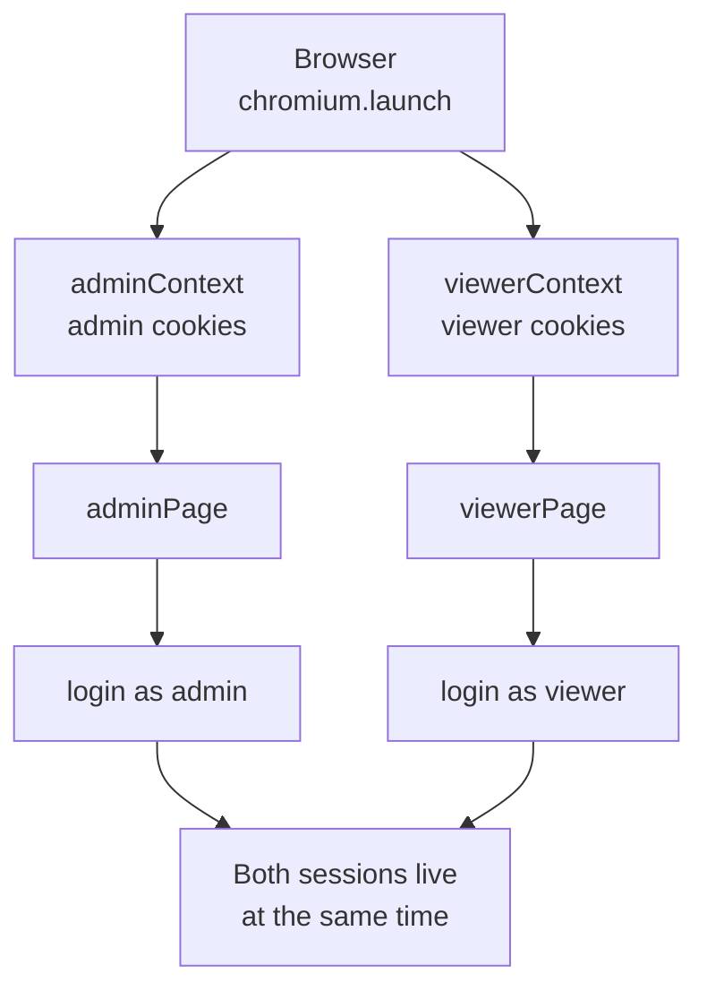

**tests/01_Basics/217_multiple_context.ts** - two isolated sessions against the same app:

```ts
import { chromium } from "playwright";

async function multiUserTest() {
    const browser = await chromium.launch({ headless: false });

    // Admin session
    const adminContext = await browser.newContext();
    const adminPage = await adminContext.newPage();
    await adminPage.goto("https://app.vwo.com/login");
    console.log("Admin: on login page");

    // Viewer session - separate cookies, same browser
    const viewerContext = await browser.newContext();
    const viewerPage = await viewerContext.newPage();
    await viewerPage.goto("https://app.vwo.com/login");
    console.log("Viewer: on login page");

    await adminContext.close();
    await viewerContext.close();
    await browser.close();
}

multiUserTest();
```

The same idea inside the test runner, where you ask for the `browser` fixture instead of `page`. **tests/01_Basics/221_TA.spec.ts** takes it to three roles:

```ts
test("BCP - three roles at once", async ({ browser }) => {
    const adminContext = await browser.newContext();
    const userContext  = await browser.newContext();
    const guestContext = await browser.newContext();

    const adminPage = await adminContext.newPage();
    await adminPage.goto("https://app.thetestingacademy.com/playwright/");

    const userPage = await userContext.newPage();
    await userPage.goto("https://sdet.live");

    const guestPage = await guestContext.newPage();
    await guestPage.goto("https://scrolltest.com");

    await adminPage.close();
    await userPage.close();
    await guestPage.close();
});
```

Ask for `browser` and you own the contexts; ask for `page` and the runner makes one context for you. Note that closing the pages does not close the contexts, in a long suite close the contexts too or they accumulate.

Once each role has a saved storage state, `newContext({ storageState: 'admin.json' })` skips the login UI entirely - see the `--save-storage` codegen flag in section 7.

---

## 11. Context options: viewport, locale, timezone, geolocation

**Concept:** `browser.newContext()` takes an options object that configures the emulated environment for every page in that context, screen size, language, timezone, GPS coordinates, permissions and device characteristics.

**Why:** Testing a French user in Paris on an iPhone otherwise means changing your OS settings; context options make that environment a per-test argument instead.

**Q&A - why use this?**
- **Q: When do I reach for it?** A: Localisation checks, "near me" features that read GPS, and responsive layouts. Anything where the app behaves differently based on who or where the user is.
- **Q: What does it replace?** A: Separate browser profiles, VPNs, and real devices for the common cases. One browser can run a Paris mobile context and a New York desktop context at once.
- **Q: What's the gotcha?** A: `geolocation` is ignored unless you also grant `permissions: ['geolocation']`. The page asks the browser, the browser checks the permission, and a context without it silently returns nothing.

```mermaid
flowchart TD
    A["browser.newContext&#40;options&#41;"] --> B[viewport<br/>1920x1080]
    A --> C[locale<br/>fr-FR]
    A --> D[timezoneId<br/>Europe/Paris]
    A --> E[geolocation<br/>lat + long]
    A --> F[permissions<br/>grants geolocation]
    B & C & D & E & F --> G[Every page in<br/>this context inherits it]
```

**tests/01_Basics/222_Test_Options.spec.ts** - a French desktop user in Paris:

```ts
test('context with options', async ({ browser }) => {
    const context = await browser.newContext({
        viewport: { width: 1920, height: 1080 },
        locale: 'fr-FR',
        timezoneId: 'Europe/Paris',
        geolocation: { latitude: 48.8566, longitude: 2.3522 },
        permissions: ['geolocation'],   // without this, geolocation is ignored
    });
    const page = await context.newPage();
    await page.goto('https://app.vwo.com/#login');
    await context.close();
});
```

The same file emulates a phone by hand:

```ts
const iPhone = {
    viewport: { width: 375, height: 667 },
    userAgent: 'Mozilla/5.0 (iPhone; CPU iPhone OS 14_0 like Mac OS X)',
    deviceScaleFactor: 2,
    isMobile: true,
    hasTouch: true,
};
const context = await browser.newContext(iPhone);
```

Playwright ships those descriptors already, so in real suites prefer the built-in list over hand-rolled objects:

```ts
import { devices } from '@playwright/test';
const context = await browser.newContext({ ...devices['iPhone 13'] });
```

---

## 12. Test annotations: skip, only, fail, fixme, slow

**Concept:** Annotations are modifiers you attach to a `test()` to change whether and how it runs, and `test.describe()` groups related tests under a shared name.

**Why:** Real suites always contain tests that are broken, unfinished, or known-failing; annotations record that intent in code instead of in a commented-out block nobody ever restores.

**Q&A - why use this?**
- **Q: What's the difference between `skip` and `fixme`?** A: Both stop the test running. `skip` means "not applicable here" (wrong browser, wrong environment), `fixme` means "this is broken and someone owes it a fix".
- **Q: What does `fail` do that `skip` doesn't?** A: `test.fail()` still runs the test and expects it to fail. If the bug gets fixed and the test starts passing, the run turns red to tell you the annotation is now stale.
- **Q: What's the gotcha?** A: `test.only` silently disables every other test in its file, and `forbidOnly` in this repo's config fails the whole CI build if one is committed. Never push it.

```mermaid
flowchart TD
    T[test&#40;&#41;] --> S["test.skip&#40;&#41;<br/>never runs"]
    T --> O["test.only&#40;&#41;<br/>runs, silences the file"]
    T --> F["test.fail&#40;&#41;<br/>runs, must fail"]
    T --> X["test.fixme&#40;&#41;<br/>skipped, flagged broken"]
    T --> L["test.slow&#40;&#41;<br/>runs, 3x timeout"]
    S --> R[Report]
    O --> R
    F --> R
    X --> R
    L --> R
```

**tests/02_TestAnnotations/223_TestAnnotations.spec.ts**:

```ts
test.skip('checkout with PayPal', async ({ page }) => {
  // never executes
});

test.fail('cart total is wrong, BUG-451', async () => {
  expect(90).toBe(100);   // expected to fail, green when it does
});

test.fixme('upload 2GB file', async () => {
  // skipped, but flagged as "needs fixing"
});

test('full regression report', async () => {
  test.slow();
  console.log(test.info().timeout);   // 90000 instead of 30000
});

// conditional: skip only on the browser that is broken
test('mobile layout', async ({ page, browserName }) => {
  test.fixme(browserName === 'webkit', 'Safari renders menu wrong');
  await page.goto("https://sdet.live");
});
```

**tests/02_TestAnnotations/224_TestDescribe.spec.ts** - grouping with `describe`, which makes the group name part of every test title:

```ts
test.describe('Login Page', () => {
  test('valid credentials', async ({ page }) => { /* ... */ });
  test('invalid password',  async ({ page }) => { /* ... */ });
  test.fixme('checkout with PayPal', async ({ page }) => { /* ... */ });
});
```

Run one group by its describe name:

```bash
npx playwright test -g "Login Page"
```

| Annotation | Runs? | Use it when |
|---|:---:|---|
| `test.skip` | no | not applicable in this environment |
| `test.fixme` | no | broken, needs a fix |
| `test.fail` | yes | known bug, must keep failing |
| `test.slow` | yes | legitimately needs 3x the timeout |
| `test.only` | yes | local debugging only, never commit |

---

## 13. Session storage: log in once, reuse everywhere

**Concept:** `context.storageState({ path })` writes the browser's cookies and localStorage to a JSON file, and `storageState: './user-session.json'` on a new context loads them back, so the test starts already logged in.

**Why:** Driving the login form at the top of every test is the single biggest time sink in an authenticated suite, and it makes every test depend on the login page still working.

**Q&A - why use this?**
- **Q: When do I reach for it?** A: Any suite where most tests need a logged-in user. Log in once in a setup script, then every spec reuses the state.
- **Q: What does it replace?** A: A `beforeEach` that fills the login form. Twenty tests means twenty logins; this makes it one.
- **Q: What's the gotcha?** A: The file holds live session cookies. It must be gitignored, it expires when the real session does, and it is environment-specific. Regenerate it when tests start failing at the login redirect.

```mermaid
flowchart LR
    A["231: log in once<br/>chromium script"] --> B["context.storageState&#40;{ path }&#41;"]
    B --> C[(user-session.json<br/>cookies + localStorage)]
    C --> D["232: test.use&#40;{ storageState }&#41;"]
    D --> E[Test 1<br/>already logged in]
    D --> F[Test 2<br/>already logged in]
    D --> G[Test 3<br/>already logged in]
```

**tests/04_Session_Storage/231_SessionStorage.ts** - the one-time login that saves the state. Credentials come from `.env`, never from the source:

```ts
import { chromium } from 'playwright';
import dotenv from "dotenv";
dotenv.config();

async function saveSession() {
    const browser = await chromium.launch({ headless: false });
    const context = await browser.newContext();
    const page = await context.newPage();

    await page.goto("https://app.wingify.com/#/login");
    await page.fill("#login-username", process.env.VWO_USER!);
    await page.fill("#login-password", process.env.VWO_PASS!);
    await page.click("#js-login-btn");
    await page.waitForURL(/#\/(dashboard|home)/, { timeout: 15000 });

    await context.storageState({ path: "./user-session.json" });
    await browser.close();
}
saveSession();
```

It is a library script, not a spec, so run it directly:

```bash
npx tsx tests/04_Session_Storage/231_SessionStorage.ts
```

**tests/04_Session_Storage/232_TestWingify.spec.ts** - `test.use` at the top of the file applies the saved state to every test in it:

```ts
test.use({ storageState: './user-session.json' });

test("go directly to dashboard - no login", async ({ page }) => {
    await page.goto("https://app.wingify.com/#/dashboard?accountId=1281316");
    await expect(page).toHaveURL(/dashboard/);
});
```

Proof that it works, the same URL with and without the saved state:

| | With `storageState` | Clean context |
|---|---|---|
| Lands on | `#/dashboard?accountId=...` | `#/login` |
| Login field visible | no | yes |

**Two rules that matter.** Add the state file and your `.env` to `.gitignore`, both contain live credentials:

```
.env
user-session.json
```

And commit a `.env.example` with empty values so a cloner knows which variables to set.

---

## 14. playwright.config.ts explained

```ts
export default defineConfig({
  testDir: './tests',              // where specs live
  fullyParallel: true,             // run test files in parallel
  forbidOnly: !!process.env.CI,    // fail CI if test.only is left behind
  retries: process.env.CI ? 2 : 0, // retry flaky tests on CI only
  workers: process.env.CI ? 1 : undefined,
  reporter: [["line"], ["allure-playwright"], ["./utils/CustomReporter.ts"]],
  use: {
    trace: 'on-first-retry',       // record a trace when a test retries
    headless: false                // show the browser locally
  },
  projects: [
    { name: 'chromium', use: { ...devices['Desktop Chrome'] } }
  ]
});
```

Add Firefox and WebKit by extending `projects`:

```ts
projects: [
  { name: 'chromium', use: { ...devices['Desktop Chrome'] } },
  { name: 'firefox',  use: { ...devices['Desktop Firefox'] } },
  { name: 'webkit',   use: { ...devices['Desktop Safari'] } },
]
```

---

## 15. Reporters: Allure, and writing your own

**Concept:** A reporter is a class implementing Playwright's `Reporter` interface, with hooks (`onTestBegin`, `onTestEnd`, `onEnd`) that fire as the run progresses. The `reporter` config key takes a list, so several can run at once.

**Why:** The built-in HTML report is fine for one developer, but a team usually wants run history, a branded summary, or results pushed somewhere, and that means owning the output.

**Q&A - why use this?**
- **Q: Can I run more than one reporter?** A: Yes, that is why the key takes an array. `[["line"], ["allure-playwright"]]` gives terminal output and Allure results from a single run.
- **Q: How do I get screenshots, video and traces into a custom report?** A: They arrive as attachments on `TestResult`. Turn them on first (`screenshot`, `video`, `trace`), then read `result.attachments` in `onTestEnd` and copy each file somewhere the HTML can link to.
- **Q: What's the gotcha?** A: `onTestBegin` and `onTestEnd` interleave under `fullyParallel`. Any counter you bump in `onTestBegin` has already moved on by the time `onTestEnd` runs, so never use it to name that test's files. Key off `test.id` instead.

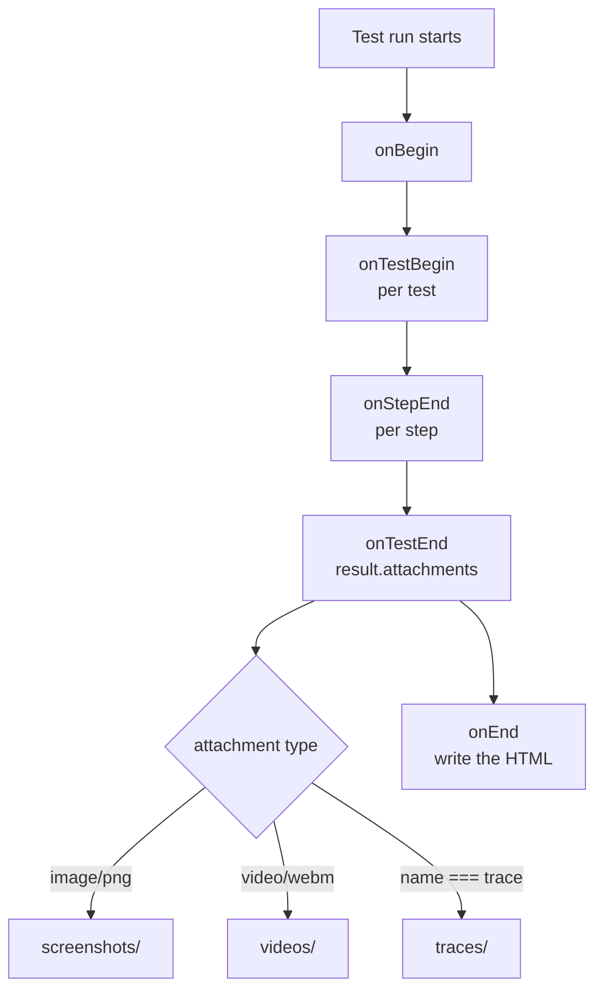

This repo's config runs two reporters:

```ts
reporter: [["line"], ["allure-playwright"]],
```

All three are configured, so a normal `npx playwright test` produces terminal output, Allure results and the TTA HTML report in one pass. To run *only* the custom one:

```bash
npx playwright test tests/05_Allure_Reporting/234_Media_Custom_Report.spec.ts \
    --reporter=./utils/CustomReporter.ts
```

**Capturing media.** Screenshots, video and traces are off by default. Turn all three on for a file with `test.use`, exactly as **tests/05_Allure_Reporting/234_Media_Custom_Report.spec.ts** does:

```ts
test.use({
    storageState: './user-session.json',
    screenshot: 'on',   // a PNG per test, pass or fail
    video: 'on',        // a .webm per test
    trace: 'on',        // a trace.zip per test
});

test('dashboard loads with media captured', async ({ page }, testInfo) => {
    await test.step('open the dashboard', async () => {
        await page.goto("https://app.wingify.com/#/dashboard?accountId=1281316");
        await expect(page).toHaveURL(/dashboard/);
    });

    await testInfo.attach('dashboard', {
        body: await page.screenshot({ fullPage: true }),
        contentType: 'image/png',
    });
});
```

`test.step()` blocks are worth the two extra lines: the reporter receives each one through `onStepEnd`, so the report shows a timed breakdown instead of one opaque test.

| Setting | Values | Cost |
|---|---|---|
| `screenshot` | `off`, `on`, `only-on-failure` | small |
| `video` | `off`, `on`, `retain-on-failure` | large, a webm per test |
| `trace` | `off`, `on`, `on-first-retry`, `retain-on-failure` | largest, ~1.3MB per test |

For real suites prefer `only-on-failure` and `on-first-retry`, which is what the repo config uses by default. `on` is for when you are demonstrating the report itself.

Generated output (`tta-report/`, `allure-results/`, `reports/`) is gitignored. To view the Allure report:

```bash
npx allure generate allure-results --clean -o allure-report && npx allure open allure-report
```

---

## 16. Traces and debugging

```bash
# force a trace for every test
npx playwright test --trace on

# open a saved trace
npx playwright show-trace test-results/<folder>/trace.zip
```

The trace viewer gives you a DOM snapshot per action, network calls, console logs, and a timeline. It is the fastest way to answer "why did this fail on CI".

---

## 17. VS Code extension

Install **Playwright Test for VSCode** (Microsoft). It gives you:

- run/debug a single test from the gutter
- **Record new** and **Record at cursor** buttons (codegen inside the editor)
- **Pick locator** from the Testing sidebar
- breakpoints in TypeScript with live browser stepping

---

## 18. Navigation: `page.goto()` options and referers

**Concept:** `page.goto()` takes an options object that decides how long Playwright waits before handing control back (`waitUntil`), how long it waits before giving up (`timeout`), and what `Referer` header the request carries.

**Why:** The default `waitUntil: 'load'` waits for every image and stylesheet, which is wasted time on a heavy page when all you need is the DOM.

**Q&A - why use this?**
- **Q: Which `waitUntil` do I actually want?** A: `domcontentloaded` for most tests, the HTML is parsed and your locators can resolve. `commit` when you only care that the server responded and want to start asserting immediately.
- **Q: What does `referer` here replace?** A: Hand-building a header on every call. It sets `Referer` for that one navigation, useful when an app gates content or analytics on where the traffic came from.
- **Q: What's the gotcha?** A: This `referer` applies to a single `goto` only. For every request in the session, set `extraHTTPHeaders` on the context instead.

```mermaid
flowchart LR
    A["page.goto&#40;url, options&#41;"] --> B{waitUntil}
    B -->|commit| C[response received<br/>fastest]
    B -->|domcontentloaded| D[HTML parsed<br/>good default]
    B -->|load| E[images + CSS done<br/>the default]
    B -->|networkidle| F[no requests 500ms<br/>discouraged, flaky]
```

**tests/03_Locator_Commands/225_LC.spec.ts** - all three options together:

```ts
test("Verify X", async ({ page }) => {
    await page.goto(
        "https://app.thetestingacademy.com/playwright/multiple_element_filter",
        { waitUntil: 'commit' }
    );

    const response = await page.goto('https://app.thetestingacademy.com/login', {
        waitUntil: 'domcontentloaded',
        timeout: 45000,
        referer: 'https://thetestingacademy.com'
    });
});
```

`goto` returns the main resource response, so you can assert on the status directly:

```ts
expect(response?.status()).toBe(200);
```

**tests/03_Locator_Commands/226_Refere.spec.ts** - the context-wide version, where every request in the session carries the header:

```ts
test("set referer for entire context", async ({ browser }) => {
    const context = await browser.newContext({
        extraHTTPHeaders: { "Referer": "https://thetestingacademy.com" }
    });
    const page = await context.newPage();

    await page.goto("https://app.vwo.com/#login");                            // referer sent
    await page.goto("https://katalon-demo-cura.herokuapp.com/profile.php");   // referer sent
});
```

| Need | Use |
|---|---|
| One navigation carries the header | `goto(url, { referer })` |
| Every request in the session carries it | `newContext({ extraHTTPHeaders })` |
| Every request in the whole suite | `use: { extraHTTPHeaders }` in the config |

---

## 19. CSS selectors and the default locator strategies

**Concept:** Before Playwright's `getByRole` family there were four classic hooks on an element, `id`, `name`, `class` and tag, and CSS selector syntax is how you reach each of them through `page.locator()`.

**Why:** Not every app is accessible enough for role-based locators; when a field has no label and no test id, a stable `id` is the next best anchor.

**Q&A - why use this?**
- **Q: When do I reach for a CSS selector?** A: When the user-facing locators cannot see the element, typically unlabelled inputs, or when the app already has stable `id` attributes you control.
- **Q: What does it replace?** A: XPath, in almost every case. CSS is shorter, faster and far more readable.
- **Q: What's the gotcha?** A: Framework-generated classes (`text-input W&#40;100%&#41;`) and obfuscated attributes (`data-qa="hocewoqisi"`) change on every build. Anchor on `id` or a `data-testid` you own, never on styling classes.

```mermaid
flowchart TD
    A[Element] --> B["id -> #login-username"]
    A --> C["class -> .text-input"]
    A --> D["name -> [name='username']"]
    A --> E["tag -> input"]
    B & C & D & E --> F["page.locator&#40;selector&#41;"]
    F --> G[Prefer getByRole / getByLabel<br/>when the app exposes them]
```

Given this real VWO login field:

```html
<input type="email" class="text-input W(100%)" name="username"
       id="login-username" data-qa="hocewoqisi" placeholder="Enter email ID">
```

**tests/03_Locator_Commands/227_Fresh.spec.ts** anchors on the stable ids and asserts the failure message:

```ts
test('tc#1 - Verify that the vwo page is loaded', async ({ page }) => {
    await page.goto("https://app.vwo.com", {
        waitUntil: 'domcontentloaded',
        referer: "https://sdet.live"
    });

    const userNameField = page.locator("#login-username");
    const passwordField = page.locator("#login-password");
    const loginButton   = page.locator("#js-login-btn");

    await userNameField.fill("admin@admin.com");
    await passwordField.fill("pass123");
    await loginButton.click();

    const errorMessage = page.locator('#js-notification-box-msg');
    await expect(errorMessage).toContainText(
        "Your email, password, IP address or location did not match");
});
```

| Hook | CSS syntax | Stable? |
|---|---|:---:|
| id | `#login-username` | yes, if hand written |
| name | `[name="username"]` | usually |
| class | `.text-input` | no, styling churns |
| tag | `input` | too broad on its own |
| test id | `[data-testid="login"]` | yes, you own it |

Two habits worth carrying out of this file: `page.pause()` is a debugging tool that halts the run and opens the Inspector, so strip it before committing; and a `timeout` under about 5000ms on a real-world site is a flake waiting to happen.

---

## 20. XPath, strict mode and why `.first()` shows up

**Concept:** Playwright accepts XPath anywhere a selector is expected (any string starting with `//` is treated as XPath), and it runs every locator in **strict mode**: if a locator matches more than one element, the action throws instead of silently picking one.

**Why:** Silently acting on "the first thing that matched" is how a test ends up clicking the wrong button for six months without anyone noticing; strict mode turns that into a loud failure on day one.

**Q&A - why use this?**
- **Q: When do I reach for XPath?** A: Rarely. Its one real advantage is matching on text or walking upward to a parent (`//div[contains(@class,'invalid-reason')]`), which CSS cannot do.
- **Q: What does `.first()` actually mean?** A: It opts that locator out of strict mode. It is an admission that the selector matches several elements and you decided the first one is fine.
- **Q: What's the gotcha?** A: `.first()` hides the ambiguity rather than fixing it. If the page order changes, the test silently targets a different element. Prefer narrowing the selector, and use `.filter({ hasText })` when you need to disambiguate by content.

```mermaid
flowchart TD
    A["page.locator&#40;selector&#41;"] --> B{How many<br/>elements match?}
    B -->|exactly 1| C[Action runs]
    B -->|0| D[Waits, then times out]
    B -->|2 or more| E[Strict mode violation]
    E --> F["Narrow the selector<br/>best fix"]
    E --> G[".filter&#40;{ hasText }&#41;<br/>disambiguate by content"]
    E --> H[".first&#40;&#41; / .nth&#40;i&#41;<br/>escape hatch"]
```

**tests/03_Locator_Commands/228_Project3.spec.ts** - XPath, attribute selectors and `.first()` on the Wingify trial form:

```ts
test("Verify the error message in the wingify free trial", async ({ page }) => {
    await page.goto("https://wingify.com/free-trial/");

    await page.locator("//input[@id='free-trial-step1-email']").fill("abccd");
    await page.locator("[data-qa='free-trial-step1-gdpr-consent-checkboxgdpr-consent-checkbox']").click();

    const errorMessage = page.locator("//div[contains(@class,'invalid-reason')]").first();
    await page.locator("//button[@data-qa='page-su-submit']").first().click();

    await expect(errorMessage).toContainText("The email address you entered is incorrect.");
});
```

**The one change worth making here.** The original file reads the text first and asserts on the string:

```ts
const text = await errorMessage.textContent();   // reads once, right now
expect(text).toContain("The email address you entered is incorrect.");
```

That assertion does not retry. It samples the DOM at the instant it runs, so if the error renders 50ms later the test fails on `null`. The web-first form polls until it matches or times out:

```ts
await expect(errorMessage).toContainText("The email address you entered is incorrect.");
```

| Form | Retries? | Use it when |
|---|:---:|---|
| `await expect(locator).toContainText(...)` | yes | almost always |
| `expect(await locator.textContent()).toContain(...)` | no | you need the raw string for other logic |

Since `//input[@id='free-trial-step1-email']` is just `#free-trial-step1-email` written the long way, the same selectors in idiomatic form:

```ts
page.locator("#free-trial-step1-email")              // instead of //input[@id='...']
page.getByRole('button', { name: 'Start free trial' })  // instead of //button[@data-qa='...']
```

---

## 21. `getByRole`: the accessibility-first locator

**Concept:** `getByRole` finds an element by the role it plays in the accessibility tree (`link`, `button`, `textbox`, `checkbox`) plus its accessible name, which is the text a screen reader would announce for it.

**Why:** Roles and labels are what the user actually perceives, so a role locator survives the CSS refactors, class renames and DOM reshuffles that break `#login-username` and `//div[contains(@class,'...')]`.

**Q&A - why use this?**
- **Q: Where does the accessible name come from?** A: Whichever the element offers first, its `aria-label`, its associated `<label>`, its `placeholder`, or its visible text. That is why `getByRole("textbox", { name: "Email" })` works on a field with no id worth using.
- **Q: What does `exact: true` change?** A: Name matching is case-insensitive and substring-based by default, so `name: "Email"` would also match "Email Address". `exact: true` demands the whole name, matched case-sensitively.
- **Q: What's the gotcha?** A: Get the role wrong and nothing matches. `<a>` styled as a button is still `link`, not `button`. When in doubt, use codegen's Pick locator, it reports the role Playwright actually sees.

```mermaid
flowchart TD
    A[Element in the DOM] --> B[Accessibility tree]
    B --> C[role<br/>link, button, textbox]
    B --> D[accessible name<br/>aria-label > label > placeholder > text]
    C & D --> E["getByRole&#40;role, { name, exact }&#41;"]
    E --> F[Survives CSS and DOM refactors]
```

**tests/03_Locator_Commands/229_getByRole.spec.ts** - two text fields with no usable ids:

```ts
test("login form fields by role", async ({ page }) => {
    await page.goto("https://app.wingify.com/#/login");

    const username = page.getByRole("textbox", { name: "Email", exact: true });
    const password = page.getByRole("textbox", { name: "Password" });

    await username.fill('admin@vwo.com');
    await password.fill('1234');
});
```

**tests/03_Locator_Commands/230_getByRole.spec.ts** - a link, not a button, despite looking like one:

```ts
test("navigate via the Make Appointment link", async ({ page }) => {
    await page.goto("https://katalon-demo-cura.herokuapp.com/");

    const mainButton = page.getByRole("link", { name: "Make Appointment", exact: true });
    await mainButton.click();

    await expect(page).toHaveURL(/profile\.php/);
});
```

| Element | Role | Not |
|---|---|---|
| `<a href="...">` | `link` | `button`, even when styled as one |
| `<button>`, `<input type="submit">` | `button` | `link` |
| `<input type="text\|email\|password">` | `textbox` | `input` |
| `<input type="checkbox">` | `checkbox` | `button` |
| `<select>` | `combobox` | `dropdown` |
| `<h1>` ... `<h6>` | `heading` | `title` |

This is the top of the preference order from section 26. Reach for CSS (section 19) only when no role or label reaches the element, and for XPath (section 20) only when you need text matching or a parent walk.

---

## 22. Multiple elements: `all()`, `allInnerTexts()`, `allTextContents()`

**Concept:** A locator that matches many elements can be unpacked three ways, `all()` hands back an array of locators you can act on, while `allInnerTexts()` and `allTextContents()` hand back plain strings in one round trip.

**Why:** Reading thirteen link labels one `textContent()` at a time costs thirteen round trips to the browser; the plural getters do it in one.

**Q&A - why use this?**
- **Q: When do I reach for `all()`?** A: Only when you need to *do* something per element, click it, read an attribute, assert on it. If you just want the text, the plural getters are one call instead of N.
- **Q: `allInnerTexts` or `allTextContents`?** A: `allTextContents` returns raw DOM text, so whitespace is exactly as authored, which makes it predictable to compare against. `allInnerTexts` returns what is rendered, collapsed and trimmed, with CSS `text-transform` applied and `<br>` turned into `\n`.
- **Q: What's the gotcha?** A: None of the three wait. They snapshot whatever is in the DOM at that instant, so on a list that is still loading you silently get a partial answer.

```mermaid
flowchart TD
    A["page.locator&#40;'a.list-group-item'&#41;"] --> B{What do you need?}
    B -->|act on each element| C["all&#40;&#41; -> Locator[]"]
    B -->|text the user sees| D["allInnerTexts&#40;&#41; -> string[]"]
    B -->|raw DOM text| E["allTextContents&#40;&#41; -> string[]"]
    C --> F[click, getAttribute, fill]
    D --> G[collapsed, CSS applied]
    E --> H[as authored, faster]
```

| | `all()` | `allInnerTexts()` | `allTextContents()` |
|---|---|---|---|
| Returns | `Locator[]` | `string[]` | `string[]` |
| Can click / getAttribute | yes | no | no |
| Whitespace | n/a | collapsed, trimmed | raw |
| CSS `text-transform` | n/a | applied | ignored |
| `<br>` | n/a | becomes `\n` | ignored |
| Waits for elements | no | no | no |
| Round trips | 1 + N per action | 1 | 1, cheapest |

The same four elements through both getters make the difference concrete:

```
allTextContents : ["   Alpha\n     line-two   ", "Hidden Beta", "gamma", "DeltaEpsilon"]
allInnerTexts   : ["Alpha line-two",             "Hidden Beta", "GAMMA", "Delta\nEpsilon"]
```

**tests/06_Multiple_Element_Filter/235_ME.spec.ts** - read the labels once, then act on a match:

```ts
const links = page.locator('a.list-group-item');
const labels: string[] = await links.allInnerTexts();

for (const label of labels) {
    if (label === "Forgotten Password") {
        await page.getByText(label).first().click();
    }
}
```

**tests/06_Multiple_Element_Filter/236_ME.spec.ts** - `all()`, because `getAttribute` needs real locators:

```ts
const links: Locator[] = await page.locator('a.list-group-item').all();
for (const link of links) {
    console.log(await link.getAttribute('href'));
}
```

**Gate on the count first.** Because none of the three wait, a list that renders late gives a partial result with no error:

```ts
const links = page.locator('a.list-group-item');
await expect(links).toHaveCount(13);      // this one retries
const all = await links.all();            // now it is safe
```

And when you are asserting rather than logging, skip all three, `toHaveText` accepts an array and auto-retries:

```ts
await expect(links).toHaveText([/Login/, /Register/]);
```

---

## 23. Web tables: iterating rows and columns

**Concept:** An HTML table has no table API in Playwright, it is just nested locators, so you read it by locating rows (`tbody tr`) and then cells (`td`) within each row.

**Why:** Table data is dynamic, you rarely know which row holds the record you want, so you scan rows until a cell matches and then read its neighbours.

**Q&A - why use this?**
- **Q: How do I skip the header row?** A: Prefer scoping to `tbody tr` and using `th` for headers. If the header sits inside `tbody`, start the loop at index 1 rather than 0.
- **Q: Do I need XPath for tables?** A: Only for one thing, walking sideways. `following-sibling::td` gets the next cell from a matched cell, which CSS cannot express.
- **Q: What's the gotcha?** A: Building selectors by string concatenation re-queries the DOM on every iteration and is slow and brittle. Chain locators off the row instead, and remember XPath indexes are 1-based while `nth()` is 0-based.

```mermaid
flowchart TD
    A["page.locator&#40;'table tbody tr'&#41;"] --> B["count&#40;&#41; -> how many rows"]
    B --> C[loop rows by index]
    C --> D["rows.nth&#40;i&#41;.locator&#40;'td'&#41;"]
    D --> E["allInnerTexts&#40;&#41; -> one row as string[]"]
    D --> F{cell matches<br/>what you want?}
    F -->|yes| G["following-sibling::td<br/>read the neighbour"]
```

**tests/07_WebTables/237_TestCase.spec.ts** - the readable approach, one call per row:

```ts
const rows = page.locator('table[summary="Sample Table"] tbody tr');
const rowCount = await rows.count();

for (let i = 0; i < rowCount - 1; i++) {
    const rowData = await rows.nth(i).locator('td').allInnerTexts();
    console.log(`Row ${i + 1}:`, rowData);
}
```

**tests/07_WebTables/238_TestCase.spec.ts** - find a record, then read the cell beside it with `following-sibling`:

```ts
const rows = await page.locator("//table[@id='customers']/tbody/tr").count();
const cols = await page.locator("//table[@id='customers']/tbody/tr[2]/td").count();

for (let i = 2; i <= rows; i++) {            // XPath rows are 1-based, row 1 is the header
    for (let j = 1; j <= cols; j++) {
        const cell = `//table[@id='customers']/tbody/tr[${i}]/td[${j}]`;
        const data = await page.locator(cell).innerText();

        if (data.includes('Helen Bennett')) {
            const country = await page.locator(`${cell}/following-sibling::td`).innerText();
            console.log(`Helen Bennett is In - ${country}`);
        }
    }
}
```

| Approach | Round trips | Readability |
|---|---|---|
| `rows.nth(i).locator('td').allInnerTexts()` | 1 per row | high |
| String-built XPath per cell | 1 per **cell** | low |

The nested-loop version is the one taught in class because it makes the row/column maths explicit, but in a real suite the first form is what you want. The whole scan also collapses into a single chained locator:

```ts
const country = await page.locator('#customers tbody tr')
    .filter({ hasText: 'Helen Bennett' })
    .locator('td')
    .last()
    .innerText();
```

---

## 24. Filtering locators: `filter()`, `:has()`, `hasText`

**Concept:** `.filter()` narrows a locator that matches many elements down to the ones containing given text or a given child, and the CSS pseudo-class `:has()` does the same thing inside the selector string.

**Why:** The element you want to click is usually anonymous (a checkbox, an edit icon) and is only identifiable by the row or card it sits in, so you find the container by its text first, then reach inside it.

**Q&A - why use this?**
- **Q: When do I reach for it?** A: Any repeated structure, table rows, cards, list items, where the target has no unique attribute of its own but its neighbour has readable text.
- **Q: `filter({ hasText })` or `:has()`?** A: They are equivalent in power. `filter()` chains and reads left to right, which is easier to debug; `:has()` keeps everything in one selector string, which is handy when you need it inside a single `locator()` call.
- **Q: What's the gotcha?** A: Both match **substrings**, so `hasText: 'Rohan.Mehta'` also matches `Rohan.Mehta2`. Pass a `RegExp` with anchors, or use `:text-is()` instead of `:text()`, when you need an exact match.

```mermaid
flowchart TD
    A["locator&#40;'tr'&#41;<br/>matches every row"] --> B{narrow by what?}
    B -->|text inside| C["filter&#40;{ hasText: 'Luca' }&#41;"]
    B -->|a child element| D["filter&#40;{ has: page.locator&#40;'.badge'&#41; }&#41;"]
    B -->|inside the selector| E["locator&#40;\"tr:has&#40;td:text&#40;'Luca'&#41;&#41;\"&#41;"]
    C & D & E --> F[one row]
    F --> G["locator&#40;'input'&#41;.click&#40;&#41;<br/>reach inside it"]
```

**tests/07_WebTables/239_TestCase.spec.ts** - filter a link list by its label:

```ts
const forgottenPasswordLink = page.locator('a.list-group-item')
    .filter({ hasText: 'Forgotten Password' });
await forgottenPasswordLink.click();

const privacyLink = page.locator('footer a').filter({ hasText: 'Privacy Policy' });
await expect(privacyLink).toHaveAttribute('href', '#privacy-policy');
```

**tests/07_WebTables/240_TestCase.spec.ts** - find the row by its name cell, then tick the checkbox in it:

```ts
await page.locator("tr:has(td:text('Rohan.Mehta'))")
    .locator('input')
    .first()
    .click();
```

The same row, written with `filter()` instead, and asserted rather than slept on:

```ts
const checkbox = page.locator('tr')
    .filter({ hasText: 'Rohan.Mehta' })
    .locator('input')
    .first();

await checkbox.check();
await expect(checkbox).toBeChecked();    // retries, no waitForTimeout needed
```

| Need | Write |
|---|---|
| Row containing text | `.filter({ hasText: 'Luca' })` |
| Row **not** containing text | `.filter({ hasNotText: 'Luca' })` |
| Row containing an element | `.filter({ has: page.locator('.badge') })` |
| Exact text, not substring | `.filter({ hasText: /^Luca Greco$/ })` |
| All in one selector | `tr:has(td:text-is('Luca Greco'))` |

---

## 25. Paginated tables: searching across pages

**Concept:** When a table splits across pages, the row you want may not be in the DOM at all, so you look on the current page, click next, and look again until you find it or run out of pages.

**Why:** `filter()` only sees what is rendered. On a paginated table it silently returns zero matches for a row that exists on page four, and the test fails with a misleading "not found".

**Q&A - why use this?**
- **Q: How do I know when to stop?** A: When the next button is disabled. That is the reliable end-of-data signal, far better than hardcoding a page count that changes with the data.
- **Q: Why `count()` rather than `isVisible()`?** A: `count()` returns 0 immediately for a missing row. `isVisible()` on an empty locator also returns false, but the count reads more clearly as "did this page have it".
- **Q: What's the gotcha?** A: `while (true)` with no exit is an infinite loop if the next button never disables. Always throw when the button is disabled, and keep the throw *inside* the loop.

```mermaid
flowchart TD
    A[Open the table] --> B["filter&#40;{ hasText: name }&#41;"]
    B --> C{count &gt; 0?}
    C -->|yes| D[Read the cells]
    C -->|no| E{next disabled?}
    E -->|yes| F[throw Row not found]
    E -->|no| G[click next]
    G --> B
```

**tests/07_WebTables/241_WebTable_Pagination.spec.ts** - the loop written inline:

```ts
let row;
while (true) {
    row = page.locator('#employees-tbody tr').filter({ hasText: 'Luca Greco' });
    if (await row.count()) break;

    const next = page.getByTestId('next-page');
    if (await next.isDisabled()) throw new Error("Row not found!");
    await next.click();
}

const email   = await row.locator('td[data-col="email"]').innerText();
const country = await row.locator('td[data-col="country"]').innerText();
```

**tests/07_WebTables/242_WebTable_Pagination.spec.ts** - the same logic lifted into a helper, which is the version to keep:

```ts
async function findRowByName(page: Page, name: string): Promise<Locator> {
    while (true) {
        const row = page.locator('#employees-tbody tr').filter({ hasText: name });
        if (await row.count()) return row;

        const next = page.getByTestId('next-page');
        if (await next.isDisabled()) throw new Error(`Row not found: ${name}`);
        await next.click();
    }
}

const row = await findRowByName(page, 'Luca Greco');
const email = await row.locator('td[data-col="email"]').innerText();
```

The helper wins on three counts: the test reads as one line of intent, the error message names the row that was missing, and the next test that needs a row does not copy the loop again.

Note `td[data-col="email"]` rather than `td:nth-child(3)`. When the app gives columns a data attribute, use it, a reordered column then changes nothing in the test.

---

## 26. Locator cheat sheet

```ts
page.getByRole('button', { name: 'Submit' })   // preferred, accessibility based
page.getByText('Welcome back')
page.getByLabel('Email Address')
page.getByPlaceholder('Enter your email')
page.getByTestId('login-button')               // needs data-testid
page.getByTitle('Close')
page.getByAltText('Company logo')

page.locator('.card').filter({ hasText: 'Pro' })
page.locator('li').nth(2)
page.locator('table tr').first()
```

Order of preference: role -> label -> placeholder -> text -> testid -> CSS/XPath. Section 24 covers narrowing a multi-match locator with `filter()`. Section 21 covers the role end of that list, sections 19 and 20 cover CSS and XPath, for the cases where the user-facing locators cannot reach the element.

---

## 27. Common assertions

```ts
await expect(page).toHaveTitle(/Playwright/);
await expect(page).toHaveURL('https://example.com/dashboard');
await expect(locator).toBeVisible();
await expect(locator).toHaveText('Logged in');
await expect(locator).toContainText('Welcome');
await expect(locator).toHaveValue('pramod');
await expect(locator).toBeEnabled();
await expect(locator).toHaveCount(5);
```

All `expect` calls auto-wait, so you rarely need `waitForTimeout`.

---

## 28. Troubleshooting

| Problem | Fix |
|---------|-----|
| `Executable doesn't exist` | run `npx playwright install` |
| Browser closes instantly | that is normal in headless mode, use `--headed` or `--debug` |
| `test.only` blocked on CI | remove `.only`, `forbidOnly` is on |
| Test flaky on CI, fine locally | run `--trace on`, open the trace, look at the failing action |
| Codegen picks ugly CSS locators | add `data-testid` attributes to the app |
| Port/proxy issues on a corporate network | `HTTPS_PROXY=... npx playwright install` |

---

## 29. Useful links

- Playwright docs: https://playwright.dev/docs/intro
- Codegen guide: https://playwright.dev/docs/codegen
- Locators: https://playwright.dev/docs/locators
- Trace viewer: https://playwright.dev/docs/trace-viewer
- Practice site used here: https://app.thetestingacademy.com/playwright/
- The Testing Academy: https://thetestingacademy.com

---

## License

MIT
