# LearnPlaywright3x — JavaScript Fundamentals & Automation Learning Repo

A learning repository tracking JavaScript fundamentals from first principles, alongside RICE-prompt notes for automation framework generation and a growing `IQ_Notes` reference library (interview-style concept explainers).

---

## Table of Contents

- [Repo Structure](#repo-structure)
- [00 — GenAI / RICE Prompting](#00--genai--rice-prompting)
- [01 — Hello World](#01--hello-world)
- [02 — `let` & Scope](#02--let--scope)
- [03 — Identifiers & Comments](#03--identifiers--comments)
- [04 — Literals & Numbers](#04--literals--numbers)
- [05 — Operators](#05--operators)
  - [05.1 — String Operators & Template Literals](#051--string-operators--template-literals)
  - [05.2 — Ternary (Conditional) Operator](#052--ternary-conditional-operator)
  - [05.3 — Nested Ternary](#053--nested-ternary)
  - [05.4 — Type Operators (`typeof`)](#054--type-operators-typeof)
  - [05.5 Increment and Decrement Operators](#055-increment-and-decrement-operators)
  - [05.6 Nullish Coalescing Operator](#056-nullish-coalescing-operator)
- [06 Statements and Conditionals](#06-statements-and-conditionals)
- [07 Switch Statements](#07-switch-statements)
- [08 User Input](#08-user-input)
- [09 Loops](#09-loops)
- [10 — Arrays](#10--arrays)
  - [10.1 — Transforming: `map` & `filter`](#101--transforming-map--filter)
  - [10.2 — Sorting](#102--sorting)
  - [10.3 — Slicing](#103--slicing)
  - [10.4 — Combining: `concat`, spread, `join`](#104--combining-concat-spread-join)
  - [10.5 — Checking: `isArray`, `every`, `some`](#105--checking-isarray-every-some)
  - [10.6 — Copying: shallow vs reference](#106--copying-shallow-vs-reference)
  - [10.7 — Destructuring](#107--destructuring)
- [11 — Functions](#11--functions)
  - [11.1 — The Four Function Types](#111--the-four-function-types)
  - [11.2 — Function Expressions & Arrow Functions](#112--function-expressions--arrow-functions)
  - [11.3 — IIFE (Immediately Invoked Function Expression)](#113--iife-immediately-invoked-function-expression)
- [MCQ — Practice Questions](#mcq--practice-questions)
- [IQ_Notes — Reference Library](#iq_notes--reference-library)

---

## Repo Structure

```
LearnPlaywright3x/
├── 00_chaptet_GENAI/
│   └── RICEPOT_SeleniumFramworkCreation.md   # RICE-style prompt for Selenium framework gen
├── 01_chapter_Javascript/
│   └── 01_HelloWorld.js                      # console.log basics
├── 02_chapter_Javascript/
│   └── 02_let_concept.js                     # let scoping, hoisting, function declarations
├── 03_chapter_Identifier/
│   ├── 03_Identifer_Rules.js                 # valid/invalid identifier characters
│   ├── 04_Identifer_Rues_Part2.js            # naming conventions (camelCase, PascalCase, etc.)
│   ├── 05_Comments.js                        # single-line, multi-line, JSDoc comments
│   └── 06_Identifer_IQ.js                    # identifier edge cases, Unicode, keywords
├── 04_chapter_Literal/
│   ├── 07_Literal.js                         # literal types + typeof
│   ├── 08_null_undefined.js                  # null vs undefined deep dive
│   ├── 09_Null_IQ.js                         # null literal one-liner
│   ├── 10_Literal.js                         # number literal formats (hex, octal, exponent)
│   ├── 11_Number.js                          # integer/float/binary/octal/hex literals
│   └── 12_Number_Part2.js                    # numeric separators, BigInt, Infinity, NaN
├── 05_chapter_Operator/
│   ├── 13_DataType.js                        # the 7 primitive types + array/NaN
│   ├── 14_Assignment_Operator.js             # =, +=, -=, *=, /=, %=
│   ├── 15_Arithmetic_Opeartor.js             # + - * / %, ** exponent, odd/even
│   ├── 16_Comparsion_Operator.js             # ==, ===, !=, !==, >, <, >=, <=
│   ├── 17_Logical_Operators.js               # && || !  (AND / OR / NOT gates)
│   ├── 18_Confusing_Comparsion.js            # "" vs 0 vs "0" coercion, broken transitivity
│   ├── 18_Confusing_Comparsion_P2.js         # null/undefined equality gotchas
│   ├── 20_Question.js                        # != vs !== practice
│   ├── 21_String_Op.js                       # string concat with + and +=, console.log multi-arg
│   ├── 22_Ternary_Op.js                      # condition ? valueIfTrue : valueIfFalse
│   ├── 23_IQ.js                              # ternary → PASS/FAIL assertion result
│   ├── 24_IQ2.js                             # ternary → env-based baseUrl switch
│   ├── 25_IQ3.js                             # ternary → CI headless vs headed
│   ├── 26_IQ4.js                             # ternary → SLA check + template literals
│   ├── 27_IQ5.js                             # ternary returning booleans (anti-pattern)
│   ├── 28_Nested_Terny_Op.js                 # nested ternary — age → drink check
│   ├── 29_IQ_NT.js                           # nested ternary — HTTP status category
│   ├── 30_NT_IQ2.js                          # nested ternary — temperature bands
│   ├── 31_Type_Op.js                         # typeof on string/number/array/null
│   ├── 32_In_De_Op.js                        # pre vs post increment (++a vs a++)
│   ├── 33_Ad_Incre.js                        # increment inside an expression
│   ├── 34_Incre_Part2.js                     # post-increment return value vs variable
│   ├── 35_Decrement.js                       # pre vs post decrement (--a vs a--)
│   └── 36_Null_Coalescing.js                 # nullish coalescing ?? (null/undefined fallback)
├── 06_chapter_Statement/
│   ├── 37_IQ.js                              # if / else -> age gate
│   ├── 38_IQ2.js                             # nested if -> drink-age check
│   └── 38_Multiple_Condition.js              # else-if ladder -> score to grade
├── 07_chapter_switch/
│   ├── 39_Switch.js                          # basic switch statement and break
│   ├── 40_IQ.js                              # deliberate fall-through example
│   ├── 41_IQ2.js                             # switch with breaks and default
│   ├── 42_REAL_API_Testing.js                # HTTP status-code branching
│   ├── 43_Switch_Group.js                    # grouped browser cases
│   ├── 44_IQ.js                              # string-case fall-through
│   ├── 45_IQ2.js                             # switch(true) range matching
│   ├── 46_IQ3.js                             # duplicate case behavior
│   └── 47_IQ4.js                             # strict case matching
├── 08_chapter_UserInputs/
│   ├── README.md                             # input methods and run instructions
│   ├── 48_JS.js                              # browser prompt input
│   ├── 49_Node_UI.js                         # Node.js readline input
│   ├── 50_Prompt.js                          # prompt-sync package input
│   └── 51_Fs.js                              # stdin input with fs.readFileSync
├── 09_chapter_Loops/
│   ├── 52_Loop.js                            # repeated statements without a loop
│   ├── 53_For_Loop.js                        # for-loop syntax and execution
│   ├── 54_Increment.js                       # prefix increment review
│   ├── 55_For_Loops.js                       # inclusive for-loop range
│   ├── 56_For_Loops2.js                      # conditions inside a for loop
│   ├── 57_While.js                           # equivalent for and while loops
│   ├── 58_While.js                           # bounded retry loop
│   ├── 59_Modie.js                           # while-loop repetition
│   ├── 60_While_Vs_For.js                    # while(true) with break
│   ├── 61_Do_While.js                        # do-while retry example
│   ├── 62_DoWhile_vs_While.js                # first-run behavior comparison
│   └── 63_NestedFor_lOOP.js                  # nested loops and index pairs
├── 10_chapter_Arrays/
│   ├── 64_Array.js                          # indexing, .at(-1), length, negative index
│   ├── 65_Array.js                          # length, out-of-bounds returns undefined
│   ├── 66_Array_Creation.js                 # literal, new Array, Array.of, Array.from
│   ├── 67_Array_Access_Modify.js            # bracket access, .at(), assign by index
│   ├── 68_Arrays_Adding_Remove.js           # push/pop/unshift/shift/splice
│   ├── 69_Array_REAL.js                     # real loop over a browser list
│   ├── 70_Array_Searching.js                # indexOf, lastIndexOf, includes
│   ├── 71_IQ.js                             # find, findIndex, findLast, findLastIndex
│   ├── 72_Array_Interate.js                 # for, for...of, forEach, entries, for...in
│   ├── 73_Arrays_Transform.js               # map (transform) vs filter (select)
│   ├── 74_Sorting.js                        # default lexicographic sort, comparators, reverse
│   ├── 75_Slicing.js                        # slice(start, end), negative indexes, no mutation
│   ├── 76_ArrayConcat.js                    # concat, spread (...), join
│   ├── 77_Array_Checking.js                 # Array.isArray, every, some, ASI semicolon trap
│   ├── 78_Copy.js                           # shallow copy 4 ways vs reference assignment
│   └── 79_Destructuring.js                  # array destructuring, rest, defaults, swap
├── 11_chapter_Funtions/
│   ├── 78_Fn.js                             # why functions exist — kill repeated logic
│   ├── 79.Fn.js                             # define once, call many times
│   ├── 80_Type1_Basic_Fn.js                 # Type 1 — no param, no return (undefined)
│   ├── 81_Type2_Basic_Fn.js                 # Type 2 — params, no return
│   ├── 82_Type3_Basic_Fn.js                 # Type 3 — no params, returns a value
│   ├── 83_Type4_Basic_Fn.js                 # Type 4 — params + return
│   ├── 84_Template_Literal.js               # returning a template literal
│   ├── 85_Fn_Exp.js                         # function declaration vs function expression
│   ├── 86_Fn_Arrow.js                       # declaration → expression → arrow, same output
│   ├── 87_Fn_Arrow.js                       # implicit vs block-bodied arrows
│   ├── 88_REAL.js                           # same status-code check in all three styles
│   └── 89.fn.js                             # IIFE — anonymous and arrow form
├── MCQ/
│   └── Array_MCQ.md                         # array practice multiple-choice questions
└── IQ_Notes/
    ├── README.md                             # reusable prompt template for new IQ notes
    ├── Source_Code_ByteCODE_Binary_IQ.md      # source vs bytecode vs machine code
    ├── 01_Identifier_Rules.md                 # identifier rules reference
    ├── 02_Keyword_Notes.md                    # all JS reserved keywords by category
    ├── 03_commands_mac.md                     # VS Code shortcuts — macOS
    └── 03_commands_win.md                     # VS Code shortcuts — Windows
```

---

### 00 — GenAI / RICE Prompting

**Concept:** `RICEPOT_SeleniumFramworkCreation.md` is a structured prompt (Role, Instructions, Context, Example, Parameters, Output, Tone) for asking an LLM to generate an enterprise-grade Selenium + Java + Maven + TestNG framework.

**Why:** Structured prompting (RICE/RICEPOT) produces more consistent, production-quality code from an LLM than a one-line ask — it constrains scope, style, and output format up front.

**Q&A — why use this?**
- **Q: What does the prompt enforce?** A: Page Object Model with `PageFactory`, XPath-only locators, no `Thread.sleep()`, no comments in generated code, TestNG annotations.
- **Q: What target app does it automate?** A: `login.salesforce.com` — valid and invalid login test cases.
- **Q: Why ban CSS/ID selectors?** A: The prompt is testing strict XPath-only locator discipline as an enterprise standard, not a technical limitation.

```
R — Role: 15-year QA automation expert
I — Instructions: Page Object Model + PageFactory, XPath only, TestNG, no Thread.sleep()
C — Context: Salesforce login page (email, password, submit, remember-me)
E — Example: sample PageFactory class structure
P — Parameters: enterprise-grade, zero bad practice
O — Output: 1 Page Object + 2 TestNG scripts + Maven project, code-only
T — Tone: technical, precise, enterprise-grade
```

---

### 01 — Hello World

**Concept:** The smallest possible JS program — printing to the console.

**Why:** Establishes the run loop (`node file.js` → V8 → stdout) before anything else.

**Q&A — why use this?**
- **Q: What runs this file?** A: Node.js, powered by the V8 engine.
- **Q: Where does `console.log` write to?** A: stdout, via V8's console binding.
- **Q: Why start here?** A: Confirms the toolchain (Node install, file execution) works before adding logic.

```js
console.log("Hello The Testing Academy!");
```

---

### 02 — `let` & Scope

**Concept:** `let` is block-scoped, unlike `var` which is function-scoped. This file also shows hoisting behavior for function declarations.

**Why:** Understanding block scope is required before writing loops or conditionals safely — `var` in a loop leaks past the block, `let` doesn't.

**Q&A — why use this?**
- **Q: Why does `badCodeFn()` work even though it's called before its declaration?** A: Function declarations are hoisted fully (name + body) to the top of their scope.
- **Q: What would break if `let a` inside the `for` were `var a`?** A: Nothing here directly, but `var` would leak `a` out of the loop's block scope into the enclosing scope.
- **Q: Why is this file called "bad code"?** A: A 100,000-iteration `console.log` + function call per tick is a deliberate anti-pattern for demonstrating performance cost, not a real-world pattern.

```js
let a = 10;
console.log(a);

for (let a = 0; a < 100000; a++) {
    console.log(a);
    badCodeFn();
}

function badCodeFn() {
    console.log("Hello");
}
```

---

### 03 — Identifiers & Comments

**Concept:** Covers legal identifier characters, naming conventions, comment syntax, and edge cases like Unicode identifiers and reserved keywords.

**Why:** Naming rules are enforced by the parser before your code ever runs — knowing the boundaries avoids `SyntaxError`s and keeps code readable across a team.

**Q&A — why use this?**
- **Q: Can an identifier start with a digit?** A: No — `let 1stPlace` throws `SyntaxError: Invalid or unexpected token`.
- **Q: Can Unicode be used in identifiers?** A: Yes — `let café` and `let 变量` are both valid; so are `\uXXXX` escape sequences.
- **Q: What's the difference between `/* */` and `/** */` comments?** A: Both are multi-line block comments to the engine; `/** */` is the JSDoc convention used by tooling (IDEs, doc generators) to extract structured documentation.

```js
let validName = "starts with letter";
let _private = "starts with underscore";
let $jquery = "starts with dollar sign";
let café = "Unicode letter é";
let 变量 = "Chinese characters";

// let 1stPlace = "invalid"; // SyntaxError
// let class = "invalid";    // reserved keyword

/**
 *  JSDoc-style comment
 *  Author : Pramod Dutta
 */
var g = 10; // cmd + /, ctrl + /
```

Full identifier rules + naming convention tables live in [`IQ_Notes/01_Identifier_Rules.md`](IQ_Notes/01_Identifier_Rules.md).

---

### 04 — Literals & Numbers

**Concept:** A literal is a fixed value written directly in source code (`42`, `"hi"`, `true`, `null`). This chapter covers every literal type, `typeof` behavior, `null` vs `undefined`, and every JS number format (decimal, binary, octal, hex, exponential, separators, BigInt, `Infinity`/`NaN`).

**Why:** JS has exactly one `number` type (IEEE 754 double) for everything except `BigInt` — no `int`/`float`/`double` split like Java or C. Knowing the literal forms and quirks (`typeof null === "object"`, `NaN !== NaN`) prevents subtle bugs.

**Q&A — why use this?**
- **Q: Why does `typeof null` return `"object"`?** A: A long-standing JS bug from the original 1995 implementation, kept for backward compatibility.
- **Q: What's the real difference between `null` and `undefined`?** A: `undefined` means "not assigned yet" (JS sets it automatically); `null` means "intentionally empty" (a developer sets it explicitly).
- **Q: When do you need `BigInt`?** A: When an integer exceeds `Number.MAX_SAFE_INTEGER` (2^53 - 1) and precision matters — append `n` to the literal or call `BigInt(...)`.

```js
// Number formats
let decimal = 42;
let binary  = 0b1010;      // 10
let octal   = 0o52;        // 42
let hex     = 0x2A;        // 42
let exp     = 1.5e3;       // 1500
let million = 1_000_000;   // numeric separator (ES2021+)
let big     = 123456789012345678901234567890n; // BigInt

// null vs undefined
let userName;              // undefined — not yet assigned
let profilePicture = null; // null — intentionally empty
console.log(typeof userName);       // "undefined"
console.log(typeof profilePicture); // "object" (quirk)

// Special numeric values
console.log(1 / 0);        // Infinity
console.log(0 / 0);        // NaN
console.log(typeof NaN);   // "number" (quirk)
```

---

### 05 — Operators

**Concept:** Operators are the symbols that act on values — assignment (`=`, `+=`), arithmetic (`+ - * / % **`), comparison (`== === != !== > <`), and logical gates (`&& || !`). This chapter also nails down JS's 7 primitive data types and the coercion quirks that make `==` dangerous.

**Why:** Every condition, loop guard, and assertion you'll ever write in a Playwright test is built from these operators — and loose `==` coercion is the #1 source of silent bugs (`"" == 0` is `true`, `null >= 0` is `true`). Knowing when to reach for `===` is non-negotiable.

**Q&A — why use this?**
- **Q: Why prefer `===` over `==`?** A: `==` coerces types before comparing (`5 == "5"` → `true`), `===` checks value **and** type (`5 === "5"` → `false`). Use `===` by default; `==` only for the deliberate `x == null` null-or-undefined check.
- **Q: What does `%` (modulus) buy me?** A: The remainder — the classic even/odd test is `n % 2 === 0` (even) vs `n % 2 === 1` (odd).
- **Q: What's the `null >= 0` gotcha?** A: `>=` coerces `null` to `0`, so `null >= 0` is `true`, yet `null == 0` is `false` and `null > 0` is `false` — relational and equality operators use different coercion rules.

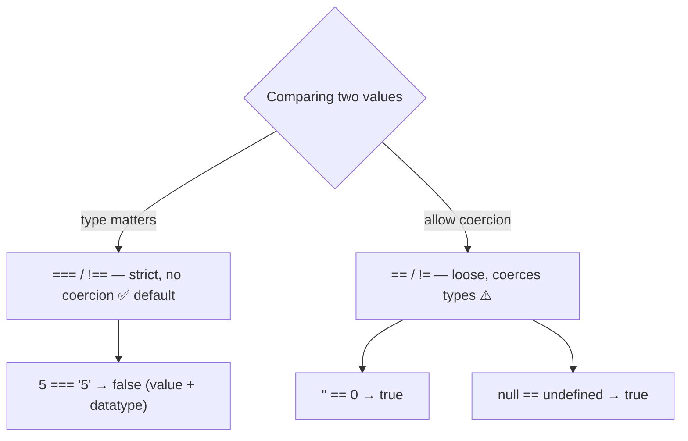

```js
// Assignment shorthands
let x = 10;
x += 5;   // 15
x *= 2;   // 30
x %= 4;   // 2   (remainder)

// Arithmetic — modulus & exponent
console.log(101 % 2);   // 1  → odd
console.log(2 ** 3);    // 8  → 2 to the power 3

// Comparison: loose vs strict
console.log(5 == "5");   // true  → == coerces "5" to 5
console.log(5 === "5");  // false → === checks value AND type

// Logical gates
let a = true, b = false;
console.log(a && b);     // false → AND
console.log(a || b);     // true  → OR
console.log(!a);         // false → NOT

// Coercion traps (why === wins)
console.log("" == 0);    // true  😬
console.log(null >= 0);  // true  🤯
console.log(null == 0);  // false
```

| Operator | Coerces types? | Use when |
|----------|:--------------:|----------|
| `===` / `!==` | No | Default — almost always |
| `==` / `!=` | Yes | Only the intentional `x == null` check |

---

#### 05.1 — String Operators & Template Literals

**Concept:** `+` doubles as string concatenation, `+=` appends in place, and backtick template literals interpolate values with `${...}`. `console.log` also accepts multiple comma-separated arguments and prints them space-separated.

**Why:** Test logs, dynamic URLs, and assertion messages are all built by joining strings — template literals do it without the `+ " " +` noise.

**Q&A — why use this?**
- **Q: When do I use a template literal over `+`?** A: Any time a variable sits inside a sentence — `` `Response: ${ms}ms` `` beats `"Response: " + ms + "ms"` for readability, and it supports multi-line strings.
- **Q: What's the difference between `console.log("a", b)` and `console.log("a" + b)`?** A: The comma form passes separate arguments (space-inserted, each formatted by type); `+` coerces `b` to a string and joins with no space.
- **Q: What's the gotcha with `+`?** A: It's overloaded — `1 + 2` is `3`, but `1 + "2"` is `"12"`. One string operand turns the whole thing into concatenation.

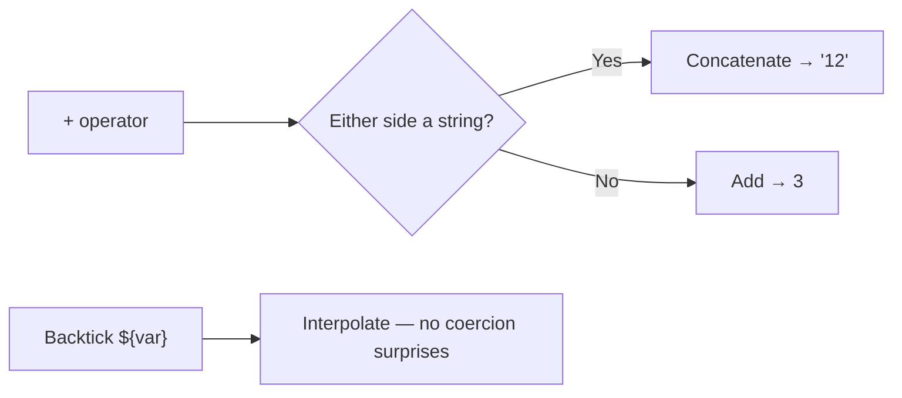

```js
let s = "Hi, ";
console.log(typeof s);       // "string"
s += "Dev";
console.log(s);              // "Hi, Dev"

console.log("Hello" + "World");        // "HelloWorld"  → concatenation
console.log("HELLO", "Prrammod");      // "HELLO Prrammod" → multi-arg, space added
console.log(1, 2, 3, 4, "Hello", true);

// Template literal
let sla = 1000;
console.log(`What is the SLA time ? - ${sla}`);
```

---

#### 05.2 — Ternary (Conditional) Operator

**Concept:** `condition ? valueIfTrue : valueIfFalse` — the only JS operator taking three operands. It's an *expression*, so it returns a value you can assign directly.

**Why:** Picking one of two values (headless vs headed, staging vs prod URL, PASS vs FAIL) is a one-liner instead of a four-line `if/else` that has to declare the variable first.

**Q&A — why use this?**
- **Q: When do I reach for it?** A: When you need a **value**, not a branch of logic — config switches, status labels, short assertion messages.
- **Q: What does it replace?** A: A pre-declared `let x;` followed by `if (cond) { x = a } else { x = b }`.
- **Q: What's the gotcha?** A: `cond ? true : false` is redundant — the condition is already a boolean, so just use `cond` (see `27_IQ5.js`). Also, don't use a ternary for side effects; use `if`.

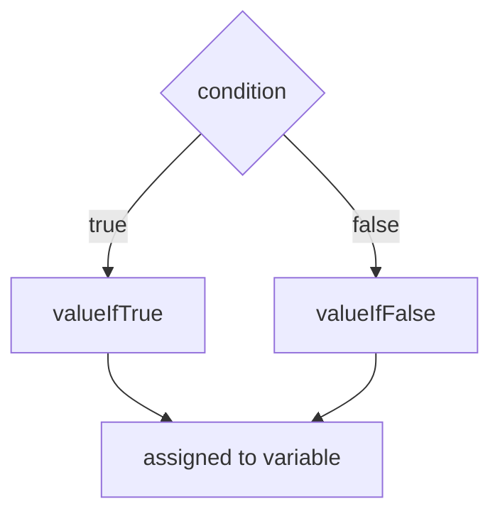

```js
// Basic form: condition ? value(if true) : value(if false)
let age = 20;
let canGo = age > 18 ? "Yes" : "No";
console.log("This person can go goa ? ", canGo);

// Assertion result
let actualStatusCode = 200, expectedStatusCode = 200;
console.log(actualStatusCode === expectedStatusCode ? "✅ PASS" : "❌ FAIL");

// Environment switch
let environment = "staging";
let baseUrl = environment === "prod"
    ? "https://api.example.com"
    : "https://staging-api.example.com";

// CI-aware browser mode
let isCI = true;
console.log("Launching browser in:", isCI ? "headless" : "headed", "mode");

// SLA check + template literal
let responseTime = 850, sla = 1000;
console.log(`Response: ${responseTime}ms — ${responseTime <= sla ? "Within SLA ✅" : "SLA breached ❌"}`);
```

---

#### 05.3 — Nested Ternary

**Concept:** A ternary whose `false` branch is another ternary, chaining several conditions into one expression — the readable form is a flat `a ? x : b ? y : z` ladder, one condition per line.

**Why:** Mapping a value onto 3+ buckets (HTTP status → category, temperature → feel) reads as a clean lookup ladder instead of a stack of `else if` blocks.

**Q&A — why use this?**
- **Q: How do I keep it readable?** A: Chain flat, not inward — put each `cond ? result :` on its own line and let the final `else` value sit last. Order matters: conditions are evaluated top-down, first match wins.
- **Q: When should I NOT nest?** A: Past ~4 branches, or when branches do anything besides return a value — switch to `if/else` or an object lookup map.
- **Q: What's the gotcha?** A: Deep inward nesting (`a ? (b ? x : y) : z`) gets unreadable fast, and a wrong condition order silently produces the wrong bucket — `statusCode < 500` before `statusCode < 400` would label every redirect a client error.

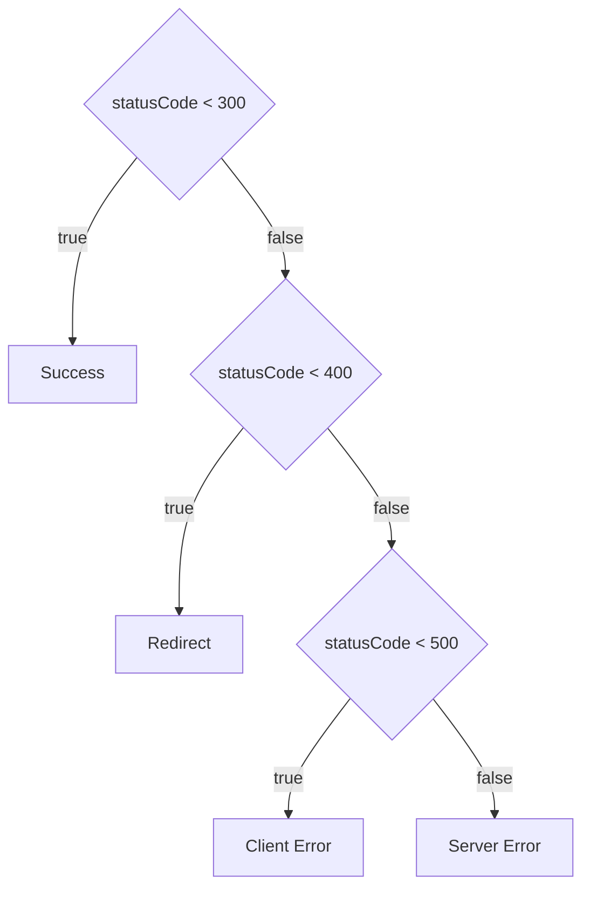

```js
// Inward nesting — works, but harder to read
let age = 26;
let enjoy = age > 18 ? (age > 26 ? "Drink" : "No") : false;
console.log(`Can pramod Drink? : ${enjoy}`);

// Flat ladder — preferred. First match wins, so order matters.
let statusCode = 404;
let category =
    statusCode < 300 ? "Success" :
    statusCode < 400 ? "Redirect" :
    statusCode < 500 ? "Client Error" : "Server Error";
console.log(`Status ${statusCode}: ${category}`);

let temp = 35;
let feel = (temp >= 40) ? "Very Hot" :
           (temp >= 30) ? "Hot" :
           (temp >= 20) ? "Warm" :
           (temp >= 10) ? "Cool" : "Cold";
console.log("Temperature:", temp, "| Feel:", feel);
```

---

#### 05.4 — Type Operators (`typeof`)

**Concept:** `typeof` is a unary operator returning the type of a value as a lowercase string — `"string"`, `"number"`, `"boolean"`, `"undefined"`, `"object"`, `"function"`, `"bigint"`, `"symbol"`.

**Why:** JS is dynamically typed, so a variable's type is only knowable at runtime — `typeof` is the runtime guard before you trust a value's shape.

**Q&A — why use this?**
- **Q: Why do `123` and `31.4` both report `"number"`?** A: JS has one numeric type (IEEE 754 double) — no `int`/`float` split.
- **Q: Why is `typeof []` `"object"`?** A: Arrays *are* objects. `typeof` can't distinguish them — use `Array.isArray([])` instead.
- **Q: What's the gotcha?** A: `typeof null === "object"` (the 1995 bug kept for compatibility). To check for null, compare directly: `x === null`.

```mermaid
flowchart TD
    T["typeof x"] --> P{primitive?}
    P -->|string/number/boolean| Exact["exact type string ✅"]
    P -->|null| Bug["'object' ⚠️ use x === null"]
    P -->|array| Arr["'object' ⚠️ use Array.isArray&#40;x&#41;"]
```

```js
console.log(typeof "hello");   // "string"
console.log(typeof 123);       // "number"  (int → number)
console.log(typeof 31.4);      // "number"  (float → number)
console.log(typeof true);      // "boolean"
console.log(typeof undefined); // "undefined"
console.log(typeof null);      // "object"  ← quirk
console.log(typeof []);        // "object"  ← use Array.isArray([])
```

| Check | Wrong way | Right way |
|-------|-----------|-----------|
| Is it null? | `typeof x === "null"` (never true) | `x === null` |
| Is it an array? | `typeof x === "array"` (never true) | `Array.isArray(x)` |

---

#### 05.5 Increment and Decrement Operators

**Concept:** `++` adds 1, `--` subtracts 1. Position matters: **pre** (`++a`) changes the variable *then* returns the new value; **post** (`a++`) returns the *old* value first, then changes the variable.

**Why:** The pre/post distinction is the classic JS interview trap and a real bug source, `let b = a++` leaves `b` holding the old value while `a` has already moved on.

**Q&A — why use this?**
- **Q: What's the difference between `++a` and `a++`?** A: `++a` increments then hands back the updated value; `a++` hands back the current value then increments. Same effect on `a`, different value returned to the expression.
- **Q: Why does `let b = a++` surprise people?** A: `a++` returns `a`'s value *before* the bump, so `b` gets the old number even though `a` is now one higher.
- **Q: What's the gotcha in expressions?** A: Mixing `++a + a++` in one line is evaluation-order dependent and unreadable, keep increments on their own statement in real code.

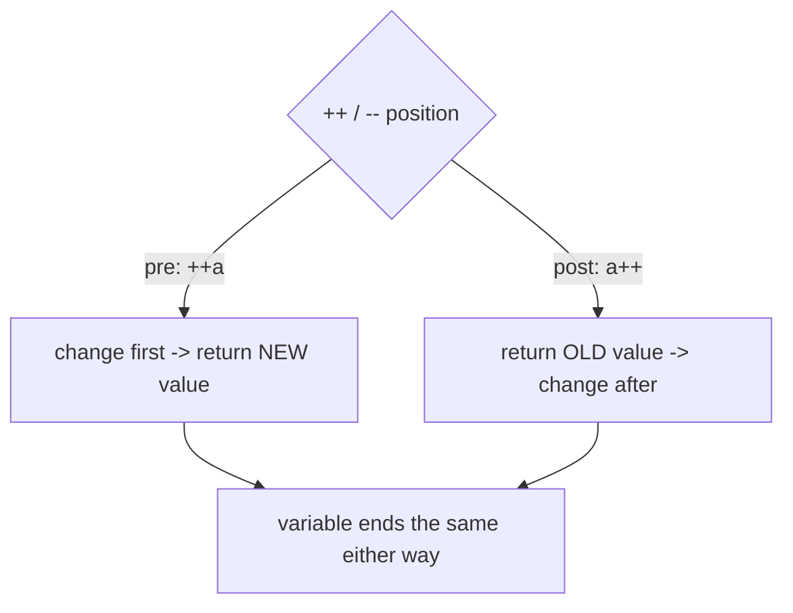

```js
// Post-increment: b gets the OLD value, a moves on
let a = 10;
let b = a++;
console.log(b);   // 10  (value before the bump)
console.log(a);   // 11

// Post-decrement mirrors it
let c = 10;
let d = c--;
console.log(d);   // 10
console.log(c);   // 9
```

---

#### 05.6 Nullish Coalescing Operator

**Concept:** `??` returns its right-hand fallback only when the left side is `null` or `undefined`. Any other value (including `0`, `""`, `false`) passes through unchanged.

**Why:** It's the safe default operator for API responses and config, `||` would wrongly replace legit falsy values like `0` or `""`, `??` only fires on genuinely missing data.

**Q&A — why use this?**
- **Q: When do I reach for it?** A: Supplying a default for a value that might be missing, `let data = apiResponse ?? "{}"`.
- **Q: How is it different from `||`?** A: `||` triggers on *any* falsy value (`0`, `""`, `false`, `null`, `undefined`); `??` triggers ONLY on `null`/`undefined`, so `0 ?? 5` is `0` but `0 || 5` is `5`.
- **Q: What's the gotcha?** A: Don't mix `??` with `&&`/`||` without parentheses, JS throws a `SyntaxError` unless you group them explicitly.

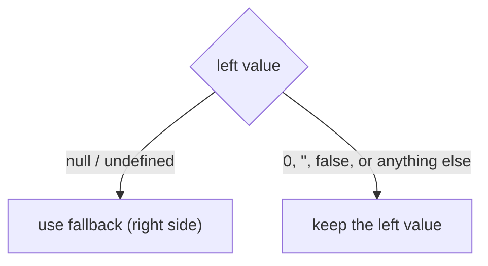

```js
let amul = null;
let val = amul ?? "NANDANI Milk";
console.log(val);            // "NANDANI Milk"  (null -> fallback)

let apiResponse = null;
console.log(apiResponse ?? "{}");   // "{}"  (missing -> fallback)

let name = "Pramod";
console.log(name ?? "{}");   // "Pramod"  (present -> kept)
```

| Left value | `left \|\| right` | `left ?? right` |
|------------|:----------------:|:---------------:|
| `null` / `undefined` | right | right |
| `0` / `""` / `false` | right | **left kept** |

---

### 06 Statements and Conditionals

**Concept:** `if / else if / else` is JS's core branching statement, it runs a block only when its condition is truthy. Blocks can nest (an `if` inside an `if`) and chain into an `else if` ladder that tests conditions top-down, first match wins.

**Why:** Every test skip, environment guard, and pass/fail branch in a Playwright suite is an `if`. Unlike the ternary operator (which returns a value), a statement runs *logic*, multiple lines, side effects, nested checks.

**Q&A — why use this?**
- **Q: When do I use `if` over a ternary?** A: When a branch does more than pick a value, logging, multiple statements, nested conditions, or side effects. Ternary is for values, `if` is for logic.
- **Q: How does an `else if` ladder evaluate?** A: Top to bottom, the first condition that is truthy runs and the rest are skipped, so order the ranges correctly (`>= 90` before `>= 80`).
- **Q: What's the gotcha with nested `if`?** A: An inner `else` binds to the nearest `if`, mis-indentation hides which condition it actually pairs with. Keep braces explicit.

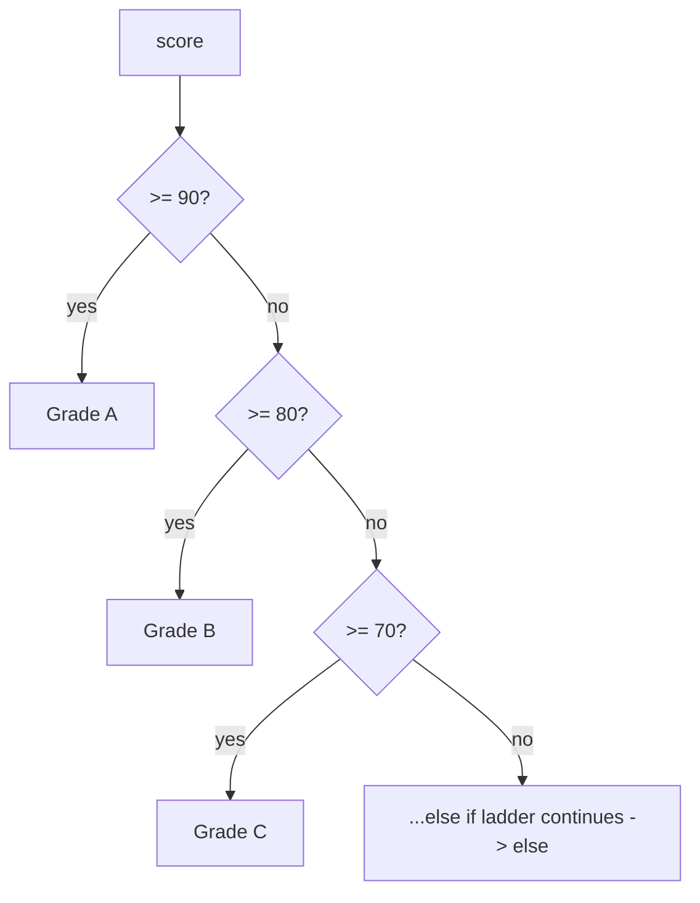

```js
// else-if ladder: first truthy branch wins, so order matters
let score = 78;

if (score >= 90) {
    console.log("Grade: A — Excellent");
} else if (score >= 80) {
    console.log("Grade: B — Good");
} else if (score >= 70) {
    console.log("Grade: C — Can do better");
} else if (score >= 60) {
    console.log("Grade: D — Needs Improvement");
} else {
    console.log("Bring parents");
}

// Nested if: inner check only runs when the outer passes
let age = 27;
if (age > 18) {
    console.log("GOA");
    if (age > 26) console.log("DRINK!");
    else console.log("You CAN'T DRINK!");
} else {
    console.log("No GOA");
}
```

| Construct | Returns a value? | Use for |
|-----------|:----------------:|---------|
| Ternary `? :` | Yes | Picking one of two values |
| `if / else` | No | Branching logic, side effects, nesting |

---

### 07 Switch Statements

**Concept:** A `switch` compares one expression against multiple `case` values using strict equality. `break` stops execution after a match; without it, execution falls through into later cases.

**Why:** A switch can make fixed-value branching clearer than a long `if / else if` chain. The chapter also covers grouped cases, `default`, deliberate fall-through, HTTP status codes, and the `switch (true)` range pattern.

```js
let responseCode = 404;

switch (responseCode) {
    case 200:
        console.log("200 OK");
        break;
    case 404:
        console.log("404 Not found!");
        break;
    default:
        console.log("No status code matched");
}
```

---

### 08 User Input

**Concept:** JavaScript input depends on its runtime. Browsers provide `prompt()`, while Node.js can use `readline`, third-party packages such as `prompt-sync`, or standard input through `fs.readFileSync(0, "utf8")`.

**Important:** `readFileSync(0, "utf8")` waits until EOF. In an interactive macOS/Linux terminal, type the value, press Enter, and then press `Ctrl+D`. Use `readline` when the user should only need to press Enter.

```js
const readline = require("readline");

const rl = readline.createInterface({
    input: process.stdin,
    output: process.stdout
});

rl.question("Enter a number: ", (input) => {
    console.log("Hi", Number(input));
    rl.close();
});
```

See [`08_chapter_UserInputs/README.md`](08_chapter_UserInputs/README.md) for a comparison of all four input methods and their run commands.

---

### 09 Loops

**Concept:** Loops repeat a block of code while a condition remains true. This chapter progresses from manual repetition to `for`, `while`, and `do...while`, then covers `break` and nested loops.

**Why:** Loops are useful for retry logic, iterating test data, repeating assertions, and processing collections. Choosing the right loop makes the stopping condition explicit and prevents accidental infinite execution.

**Q&A — why use this?**
- **Q: When should I use a `for` loop?** A: When the initialization, condition, and update are known up front, especially for a fixed number of iterations.
- **Q: When should I use a `while` loop?** A: When repetition depends mainly on a condition, such as retrying until a limit or state change.
- **Q: What makes `do...while` different?** A: Its body runs once before the condition is checked, so it always executes at least once.
- **Q: What does `break` do?** A: It immediately exits the nearest loop.

```js
// Fixed number of iterations
for (let i = 0; i < 3; i++) {
    console.log(i);
}

// Condition-controlled repetition
let attempts = 0;
while (attempts < 3) {
    console.log("Attempt", attempts);
    attempts++;
}

// Always runs at least once
let value = 10;
do {
    console.log(value);
    value++;
} while (value < 10);
```

---

### 10 — Arrays

**Concept:** An array is an ordered, zero-indexed list that holds many values in one variable. This chapter covers creation, access with brackets and `.at()`, adding/removing with `push`/`pop`/`unshift`/`shift`/`splice`, searching with `indexOf`/`includes`/`find`, and every way to iterate.

**Why:** Test data is almost always a list, browsers to run, expected results, form rows, API records. Arrays are how you store and walk that data, so every loop, filter, and assertion over a collection starts here.

**Q&A — why use this?**
- **Q: What does negative indexing need?** A: Bracket access does NOT support negatives (`arr[-1]` is `undefined`); use `arr.at(-1)` to read from the end. `.at(-1)` is the last item, `.at(-2)` the second last.
- **Q: How is `splice` different from `slice`?** A: `splice(start, deleteCount, ...items)` mutates the array in place and can remove and insert at once; `slice` returns a copy and never mutates. `push`/`pop` work at the end, `unshift`/`shift` at the start.
- **Q: When do I use `find` vs `indexOf` vs `includes`?** A: `includes(value)` returns a boolean, `indexOf(value)` returns the first position (or `-1`), and `find(fn)` returns the first element matching a test function (`findIndex` returns its position).

```mermaid
flowchart TD
    A["Array [a, b, c]"] --> Read{Reading}
    Read -->|by position| Br["arr[0], arr.at&#40;-1&#41;"]
    Read -->|search value| Se["indexOf, includes, find"]
    A --> Write{Changing}
    Write -->|end| E["push / pop"]
    Write -->|start| S["unshift / shift"]
    Write -->|anywhere| Sp["splice&#40;i, del, ...add&#41;"]
    A --> It["Iterate: for, for...of, forEach, entries"]
```

```js
let browsers = ["chrome", "firefox", "webkit"];

// Access — brackets are zero-indexed; .at() allows negatives
console.log(browsers[0]);      // "chrome"
console.log(browsers.at(-1));  // "webkit"  (last)
console.log(browsers[-1]);     // undefined (brackets: no negatives)

// splice(start, deleteCount, ...itemsToAdd) — mutates in place
let arr = [1, 2, 3, 5, 6];
arr.splice(2, 1);          // remove 1 at index 2 -> [1, 2, 5, 6]
arr.splice(2, 0, 99);      // insert 99 at index 2 -> [1, 2, 99, 5, 6]
arr.splice(1, 2, 10, 20);  // replace 2 with 10,20 -> [1, 10, 20, 5, 6]

// Search
let results = ["pass", "fail", "pass", "error"];
console.log(results.indexOf("fail"));   // 1
console.log(results.includes("skip"));  // false

// Find first match by a test function
let nums = [10, 25, 30, 45];
console.log(nums.find(n => n > 20));      // 25
console.log(nums.findIndex(n => n > 20)); // 1

// Iterate — for...of for values, entries() for index + value
for (let [i, browser] of browsers.entries()) {
    console.log(i, browser);
}
```

| Method | Mutates? | Returns |
|--------|:--------:|---------|
| `push` / `unshift` | Yes | new length |
| `pop` / `shift` | Yes | removed element |
| `splice` | Yes | array of removed elements |
| `slice` | No | shallow copy |
| `indexOf` / `findIndex` | No | index or `-1` |
| `find` | No | element or `undefined` |

---

#### 10.1 — Transforming: `map` & `filter`

**Concept:** `map(fn)` runs a function on every element and returns a **new array of the same length** (one output per input). `filter(fn)` runs a test on every element and returns a **new, usually shorter array** containing only the elements that passed.

**Why:** Raw test data is rarely in the shape you need, `map` converts scores to Pass/Fail labels, and `filter` narrows a full result set down to just the failures you want to report.

**Q&A — why use this?**
- **Q: How do I pick between `map` and `filter`?** A: Ask what changes. Changing each **value** but keeping the count → `map`. Keeping values but dropping some **rows** → `filter`. Need both? Chain them: `.filter(...).map(...)`.
- **Q: Do they mutate the original array?** A: No. Both return a brand-new array, the source is untouched, which is why you must assign the result (`let out = arr.map(...)`) or it is thrown away.
- **Q: What if my `map` callback returns nothing?** A: You get an array of `undefined`. An arrow with braces needs an explicit `return`, `s => { s * 2 }` is a silent bug, use `s => s * 2`.

```mermaid
flowchart LR
    A["[45, 82, 91, 60, 73]"] --> M["map&#40;s =&gt; s &gt; 70 ? 'Pass' : 'Fail'&#41;"]
    A --> F["filter&#40;s =&gt; s &gt;= 70&#41;"]
    M --> MR["['Fail','Pass','Pass','Fail','Pass'] — same length"]
    F --> FR["[82, 91, 73] — shorter"]
```

```js
let scores = [45, 82, 91, 60, 73];

// map — transform each element, same length out
let grades = scores.map(s => s > 70 ? "Pass" : "Fail");
console.log(grades);  // ["Fail", "Pass", "Pass", "Fail", "Pass"]

// filter — keep only what passes the test, shorter out
let passing = scores.filter(s => s >= 70);
console.log(passing); // [82, 91, 73]

console.log(scores);  // [45, 82, 91, 60, 73] — original untouched

// Chain them: narrow first, then reshape
let report = scores.filter(s => s < 70).map(s => `FAIL(${s})`);
console.log(report);  // ["FAIL(45)", "FAIL(60)"]
```

---

#### 10.2 — Sorting

**Concept:** `sort()` with no argument converts every element to a **string** and compares them character by character (lexicographic order), which is why `[10, 1, 21, 2].sort()` gives `[1, 10, 2, 21]`. Pass a comparator, `sort((a, b) => a - b)`, to sort numerically.

**Why:** Sorting durations, response times, or numeric IDs with a bare `sort()` silently produces the wrong order, and the bug hides until a two-digit number shows up in the data.

**Q&A — why use this?**
- **Q: Why is `[10, 1, 21, 2].sort()` → `1, 10, 2, 21`?** A: Elements become `"10","1","21","2"` and are compared char by char, `'1'`(49) is less than `'2'`(50), so `"10"` lands before `"2"`. This is lexicographic (dictionary) order, not numeric.
- **Q: How do I get ascending and descending?** A: `sort((a, b) => a - b)` for ascending, `sort((a, b) => b - a)` for descending. Negative return means `a` comes first.
- **Q: Does `sort` mutate?** A: Yes, `sort` and `reverse` both change the array in place **and** return it. To keep the original, sort a copy: `[...arr].sort((a,b) => a-b)`. Use `toSorted()` (ES2023) for a non-mutating version.

```mermaid
flowchart TD
    S["sort&#40;&#41;"] --> Q{Comparator passed?}
    Q -->|No| L["Convert to string, compare chars — '10' &lt; '2'"]
    Q -->|"&#40;a,b&#41; =&gt; a-b"| ASC["Numeric ascending"]
    Q -->|"&#40;a,b&#41; =&gt; b-a"| DESC["Numeric descending"]
    L --> W["[1, 10, 2, 21] — usually wrong for numbers"]
    ASC --> R["[1, 2, 10, 21]"]
    DESC --> R2["[21, 10, 2, 1]"]
```

```js
let fruits = ["banana", "apple", "cherry"];
fruits.sort();
console.log(fruits);           // ["apple", "banana", "cherry"] — alphabetical is fine

let nums = [10, 1, 21, 2];
console.log([...nums].sort()); // [1, 10, 2, 21]  <-- string comparison, NOT numeric

console.log([...nums].sort((a, b) => a - b)); // [1, 2, 10, 21]  ascending
console.log([...nums].sort((a, b) => b - a)); // [21, 10, 2, 1]  descending

nums.sort((a, b) => a - b);
nums.reverse();                // mutates in place
console.log(nums);             // [21, 10, 2, 1]

// Human "natural" order for strings containing digits
console.log(["file10", "file2", "file1"]
    .sort(new Intl.Collator(undefined, { numeric: true }).compare));
// ["file1", "file2", "file10"]
```

---

#### 10.3 — Slicing

**Concept:** `slice(start, end)` returns a **new array** copying elements from index `start` up to but **not including** `end`. It never mutates. Negative indexes count from the right, and omitting `end` runs to the end of the array.

**Why:** Pagination, "top 3 failures", and "last 5 log lines" are all slices, and because `slice` copies instead of mutating, the original result set stays intact for the next assertion.

**Q&A — why use this?**
- **Q: Is `end` included?** A: No. `slice(1, 3)` returns indexes 1 and 2 only. Handy identity: the length of the result is `end - start`.
- **Q: What do negative numbers do?** A: They count from the end, `slice(-2)` is the last two elements, `slice(-3)` the last three. `slice(0)` and `slice(-arr.length)` both copy the whole array.
- **Q: Why did `slice(-3, -5)` return `[]`?** A: `-3` resolves to index 2 and `-5` to index 0, so `start` is after `end`. Whenever `start >= end`, `slice` returns an empty array, it never wraps around.

```mermaid
flowchart LR
    A["[1, 2, 3, 4, 5]<br/>idx  0  1  2  3  4<br/>neg -5 -4 -3 -2 -1"] --> B["slice&#40;1, 3&#41; → [2, 3]"]
    A --> C["slice&#40;2&#41; → [3, 4, 5]"]
    A --> D["slice&#40;-2&#41; → [4, 5]"]
    A --> E["slice&#40;-3, -5&#41; → [] — start after end"]
```

```js
let arr = [1, 2, 3, 4, 5];

console.log(arr.slice(1, 3));  // [2, 3]      end is EXCLUSIVE
console.log(arr.slice(2));     // [3, 4, 5]   no end -> to the end
console.log(arr.slice(-2));    // [4, 5]      last two
console.log(arr.slice(-3));    // [3, 4, 5]   last three
console.log(arr.slice(0));     // [1,2,3,4,5] full shallow copy
console.log(arr.slice(-3, -5));// []          start(2) >= end(0)

console.log(arr);              // [1,2,3,4,5] original never mutated
```

---

#### 10.4 — Combining: `concat`, spread, `join`

**Concept:** `concat` merges arrays into a new array, the spread operator `...` does the same thing with modern syntax and more flexibility, and `join(separator)` collapses an array down into a single string.

**Why:** Test suites get assembled from parts (smoke + regression browsers), and failures get reported as one readable line, both are merge-then-stringify problems.

**Q&A — why use this?**
- **Q: `concat` or spread?** A: Same result for a simple merge. Spread wins when you mix in loose values or change the order: `[...a, "extra", ...b]`. `concat` wins when the source is not iterable-friendly or you are chaining.
- **Q: What separator does `join()` use by default?** A: A comma. `join("")` glues with nothing, `join(" | ")` gives a readable report line. `null` and `undefined` elements become empty strings.
- **Q: Do these mutate?** A: No, all three return something new. That also makes `arr.concat()` with zero arguments a quick shallow copy.

```mermaid
flowchart LR
    A["a = [1, 2]"] --> C["concat / ...spread"]
    B["b = [3, 4]"] --> C
    C --> D["[1, 2, 3, 4]"]
    D --> J["join&#40;' | '&#41;"]
    J --> S["'1 | 2 | 3 | 4' — a String, not an Array"]
```

```js
let a = [1, 2];
let b = [3, 4];

console.log(a.concat(b));      // [1, 2, 3, 4]
console.log([...a, ...b]);     // [1, 2, 3, 4]   spread — modern way
console.log([...a, 99, ...b]); // [1, 2, 99, 3, 4]  mix in loose values

// join — array into one string
console.log(["pass", "fail", "skip"].join(" | ")); // "pass | fail | skip"
console.log(["a", "b"].join());                    // "a,b"  (comma default)

console.log(a); // [1, 2] — nothing mutated
```

---

#### 10.5 — Checking: `isArray`, `every`, `some`

**Concept:** `Array.isArray(x)` is the only reliable array check (`typeof []` lies and says `"object"`). `every(fn)` returns `true` only if **all** elements pass, `some(fn)` returns `true` if **at least one** does.

**Why:** Assertions are usually "all responses were under 2s" (`every`) or "at least one test failed" (`some`), and `isArray` guards code that assumes a list before it blows up on a string.

**Q&A — why use this?**
- **Q: Why not `typeof arr === "object"`?** A: Because it is true for `{}`, `null` and every other object. `Array.isArray([1,2,3])` → `true`, `Array.isArray("a")` → `false`. It also works across iframes, unlike `instanceof Array`.
- **Q: What do `every` and `some` return on an empty array?** A: `every` returns `true` (vacuous truth, nothing failed) and `some` returns `false` (nothing passed). This bites when an empty result set silently "passes" an assertion.
- **Q: Why did this file throw `Cannot read properties of undefined`?** A: A line ending in `)` with no semicolon, followed by a line starting with `[`, gets glued together by ASI into an index access. Always terminate statements that start with `[` or `(`.

```mermaid
flowchart TD
    A["[80, 60, 85]"] --> E["every&#40;s =&gt; s &gt;= 70&#41;"]
    A --> S["some&#40;s =&gt; s &lt; 70&#41;"]
    E --> ER["false — 60 fails, stops early"]
    S --> SR["true — 60 matches, stops early"]
    G["Guard first"] --> IA["Array.isArray&#40;x&#41;"]
    IA --> OK["true → safe to map/filter"]
    IA --> NO["false → it is a string/object"]
```

```js
console.log(Array.isArray([1, 2, 3])); // true
console.log(Array.isArray("a"));       // false
console.log(typeof [1, 2, 3]);         // "object"  <-- why isArray exists

// every — ALL must pass
console.log([80, 90, 85].every(s => s >= 70)); // true
console.log([80, 60, 85].every(s => s >= 70)); // false

// some — AT LEAST ONE must pass
console.log([80, 60, 85].some(s => s < 70));   // true
console.log([80, 90, 85].some(s => s < 70));   // false

// Empty-array trap
console.log([].every(s => s >= 70)); // true  — nothing failed
console.log([].some(s => s >= 70));  // false — nothing passed
```

---

#### 10.6 — Copying: shallow vs reference

**Concept:** Spread `[...arr]`, `slice()`, `Array.from(arr)` and `concat()` all produce a **shallow copy**, a genuinely separate array. Plain assignment `let b = a` copies only the **reference**, so both names point at the same array.

**Why:** Sharing a reference between tests means one test's `push` corrupts another's fixture data, the classic "my test passes alone but fails in the suite" bug.

**Q&A — why use this?**
- **Q: What makes `let copy = original` different from `[...original]`?** A: Assignment copies the pointer, not the data. `copy.push(99)` changes `original` too. Spread allocates a new array, so pushes stay local.
- **Q: What does "shallow" mean?** A: Only the top level is copied. If elements are objects or nested arrays, both copies still share those inner references, `copy[0].name = "x"` is visible in the original.
- **Q: How do I get a real deep copy?** A: `structuredClone(arr)` (built into Node 17+ and modern browsers) or `JSON.parse(JSON.stringify(arr))` for plain data, note the JSON trick loses `Date`, `undefined`, and functions.

```mermaid
flowchart TD
    O["original = [1, 2, 3]"] --> R["let ref = original<br/>&#40;reference copy&#41;"]
    O --> S["[...original] / slice&#40;&#41; / Array.from&#40;&#41; / concat&#40;&#41;<br/>&#40;shallow copy&#41;"]
    R --> RB["ref.push&#40;99&#41; → original ALSO changes"]
    S --> SB["copy.push&#40;99&#41; → original unchanged"]
```

```js
let original = [1, 2, 3];

// Four ways to shallow-copy — all independent arrays
let copy1 = [...original];        // spread
let copy2 = original.slice();     // slice with no args
let copy3 = Array.from(original); // Array.from
let copy4 = original.concat();    // concat with no args

copy1.push(99);
console.log(original); // [1, 2, 3]      untouched
console.log(copy1);    // [1, 2, 3, 99]

// Reference assignment — NOT a copy
let ref = original;
ref.push(91);
console.log(original); // [1, 2, 3, 91]  both changed
console.log(ref);      // [1, 2, 3, 91]  same array

// Shallow is only one level deep
let users = [{ name: "amit" }];
let shallow = [...users];
shallow[0].name = "raj";
console.log(users[0].name);            // "raj"  — inner object still shared
let deep = structuredClone(users);     // real deep copy
deep[0].name = "neha";
console.log(users[0].name);            // "raj"  — original safe
```

---

#### 10.7 — Destructuring

**Concept:** Array destructuring unpacks values into variables by **position** in one statement: `let [a, b] = [10, 20]`. A rest pattern `...rest` sweeps up everything left over into a new array, and `=` supplies defaults for missing slots.

**Why:** It removes a wall of `arr[0]`, `arr[1]` lines, and it is how you read Playwright/Node APIs that hand back pairs, `for (let [i, v] of arr.entries())` and `const [res1, res2] = await Promise.all([...])`.

**Q&A — why use this?**
- **Q: Does it match by name or position?** A: Position. `let [first, second] = [10, 20]` gives `first = 10` regardless of naming, the variable name is arbitrary. (Object destructuring is the name-based one.)
- **Q: Where can the rest element go?** A: Last only. `[...rest, last]` is a SyntaxError. Rest always collects the remainder into a new array, `[]` if nothing is left.
- **Q: When do defaults kick in?** A: Only for `undefined`, not for `null` or `0`. `let [x = 1] = [null]` leaves `x` as `null`. Also, `let` cannot be redeclared in the same scope, so reusing the same variable names in a second destructuring throws `Identifier 'first' has already been declared`.

```mermaid
flowchart LR
    A["[10, 20, 30, 40, 50]"] --> B["let [a, b, ...rest]"]
    B --> C["a = 10 &#40;pos 0&#41;"]
    B --> D["b = 20 &#40;pos 1&#41;"]
    B --> E["rest = [30, 40, 50] &#40;new array&#41;"]
    F["[10, 20]"] --> G["let [x = 1, y = 2, z = 99]"]
    G --> H["x=10, y=20, z=99 &#40;default used&#41;"]
```

```js
let [first, second, third] = [10, 20, 30];
console.log(first, second, third); // 10 20 30

// Rest — collects the remainder into a NEW array (must be last)
let [a, b, ...rest] = [10, 20, 30, 40, 50];
console.log(a, b, rest);           // 10 20 [30, 40, 50]

// Defaults — only used when the slot is undefined
let [x = 1, y = 2, z = 99] = [10, 20];
console.log(x, y, z);              // 10 20 99

// Skip elements with a hole
let [, , thirdOnly] = [10, 20, 30];
console.log(thirdOnly);            // 30

// Swap without a temp variable
let p = 1, q = 2;
[p, q] = [q, p];
console.log(p, q);                 // 2 1
```

| Task | Syntax |
|------|--------|
| Grab by position | `let [a, b] = arr` |
| Skip a slot | `let [, , c] = arr` |
| Collect the rest | `let [a, ...rest] = arr` |
| Default value | `let [a = 0] = arr` |
| Swap | `[a, b] = [b, a]` |
| Index + value in a loop | `for (let [i, v] of arr.entries())` |

---

### 11 — Functions

**Concept:** A function is a named block of logic you define once and call as many times as you like, optionally feeding it **parameters** and optionally getting a value back with `return`.

**Why:** Without functions the same three lines get copy-pasted for every score, every user, every browser, and a fix has to be applied in ten places. A function makes it one place.

**Q&A — why use this?**
- **Q: When do I reach for it?** A: The moment the same logic appears twice, or when a block deserves a name (`getResult`, `openBrowser`) so the calling code reads like a sentence.
- **Q: What does a function return if I never write `return`?** A: `undefined`. `let output = greet()` where `greet` only logs gives `output === undefined`, not the logged text.
- **Q: What's the gotcha?** A: Calling a function without using its result (`getResult(85);` on its own line) computes the value and throws it away — assign it or log it.

```mermaid
flowchart TD
    D["Define: function getResult&#40;score&#41; { ... }"] --> C["Call: getResult&#40;85&#41;"]
    C --> P["parameter score ← argument 85"]
    P --> B["body runs"]
    B --> R{"return hit?"}
    R -->|yes| V["value handed back to caller"]
    R -->|no| U["undefined handed back"]
```

```js
// Without a function — the same ternary copy-pasted per score
// let result1 = score1 >= 70 ? "pass" : "fail";
// let result2 = score2 >= 70 ? "pass" : "fail";

// Define once
function getResult(score) {
    return score >= 70 ? "pass" : "fail";
}

// Call many times
console.log(getResult(85)); // "pass"
console.log(getResult(45)); // "fail"

// Parameter vs argument
function sayHello(name) {   // name = parameter (the placeholder)
    console.log(name);
}
sayHello("Pramod");         // "Pramod" = argument (the real value)
sayHello("Siba");
```

| Term | Means |
|------|-------|
| Parameter | The placeholder in the definition — `function f(name)` |
| Argument | The real value at the call site — `f("Pramod")` |
| `return` | Hands a value back to the caller and exits the function |
| No `return` | Caller receives `undefined` |

---

#### 11.1 — The Four Function Types

**Concept:** Every function falls into one of four shapes, decided by two independent questions: does it take parameters, and does it `return` a value?

**Why:** Naming the four shapes makes the "why is my variable `undefined`?" bug obvious — a Type 1 or Type 2 function has nothing to assign, because logging is not returning.

**Q&A — why use this?**
- **Q: When do I reach for each?** A: Type 1 (no param, no return) for fixed side effects like `openBrowser()`. Type 2 (param, no return) for logging per input. Type 3 (no param, return) for config getters like `getEnv()`. Type 4 (param + return) for real computation — the most useful one.
- **Q: Why is `let output = greet()` `undefined` when `greet` clearly prints "Hi"?** A: `console.log` writes to stdout, it does not `return`. A function with no `return` always evaluates to `undefined`.
- **Q: What's the gotcha?** A: `return` can hand back anything — a string, an array (`return [12,2,3]`), an object. It is not restricted to numbers, and it exits the function immediately.

```mermaid
flowchart TD
    Q1{"Takes parameters?"} -->|No| Q2{"Returns a value?"}
    Q1 -->|Yes| Q3{"Returns a value?"}
    Q2 -->|No| T1["Type 1 — greet&#40;&#41; → undefined"]
    Q2 -->|Yes| T3["Type 3 — getEnv&#40;&#41; → 'staging'"]
    Q3 -->|No| T2["Type 2 — greetByName&#40;'Pramod'&#41; → undefined"]
    Q3 -->|Yes| T4["Type 4 — sum&#40;4,5&#41; → 9"]
```

```js
// Type 1 — no param, no return (void). Result is undefined.
function greet() { console.log("Hi"); }
let output = greet();
console.log(output);              // undefined

// Type 2 — param, no return
function greetByName(name) { console.log("Hi", name); }
console.log(greetByName("Sumit")); // logs "Hi Sumit", then undefined

// Type 3 — no param, returns
function sayHello() {
    console.log("Hi");
    return "helllo";
}
console.log(sayHello());          // "helllo"

function greetByHi() { return [12, 2, 3, 3, 2]; }  // return can be an array
console.log(greetByHi());         // [12, 2, 3, 3, 2]

// Type 4 — param + return. The workhorse.
function sumOfTwoNumbers(a, b) { return a + b; }
console.log(sumOfTwoNumbers(4, 5)); // 9

// Template literal in a return
function greetTpl(name) { return `Hello. ${name}`; }
console.log(greetTpl("Alice"));   // "Hello. Alice"
```

| Type | Params | Return | Example | Value at call site |
|:----:|:------:|:------:|---------|--------------------|
| 1 | No | No | `greet()` | `undefined` |
| 2 | Yes | No | `greetByName("Pramod")` | `undefined` |
| 3 | No | Yes | `getEnv()` | `"staging"` |
| 4 | Yes | Yes | `sumOfTwoNumbers(4,5)` | `9` |

---

#### 11.2 — Function Expressions & Arrow Functions

**Concept:** The same logic can be written three ways: a **declaration** (`function greet(){}`), an **expression** assigned to a variable (`const greet = function(){}`), or an **arrow** (`const greet = (n) => ...`). The arrow is the expression form with `function`, `return`, and the braces stripped away.

**Why:** Arrow functions are the default in modern JS and in every Playwright callback (`page.on('response', res => ...)`, `arr.map(s => s * 2)`), so reading and writing all three forms is not optional.

**Q&A — why use this?**
- **Q: How do I convert a normal function to an arrow?** A: Drop the `function` keyword, drop `return`, drop the braces, and put `=>` between the parameter list and the body — `function f(n){ return n*2 }` becomes `const f = (n) => n * 2`.
- **Q: When do I keep the braces on an arrow?** A: Whenever the body is more than one expression. Braces mean a block body, and a block body needs an explicit `return` — `(s) => { s * 2 }` silently returns `undefined`.
- **Q: What's the gotcha?** A: Declarations are hoisted (callable before their line); expressions and arrows are not — calling one before its `const` line throws `ReferenceError: Cannot access 'greet1' before initialization`.

```mermaid
flowchart TD
    A["function greet&#40;name&#41; { return `Hello, ${name}!`; }"] --> B["drop 'function' keyword"]
    B --> C["const greet1 = function &#40;name&#41; { return ... }"]
    C --> D["drop 'return' + braces, add =&gt;"]
    D --> E["const greet2 = &#40;name&#41; =&gt; `Hello, ${name}!`"]
    E --> F["all three log the same output"]
```

```js
// 1. Declaration — hoisted, has a name
function greet(name) { return `Hello, ${name}!`; }

// 2. Expression — anonymous function assigned to a const, NOT hoisted
const greet1 = function (name1) { return `Hello, ${name1}!`; };

// 3. Arrow — implicit return, one expression, no braces
const greet2 = (name2) => `Hello, ${name2}!`;

console.log(greet("Pramod"), greet1("Pramod"), greet2("Pramod")); // all identical

// Implicit return — no braces, value falls out
const doubleMe = (a) => a * 2;
const getEnv = () => "staging";       // no params → empty parens required
console.log(getEnv());                // "staging"

// Block body — braces mean you MUST write return
const getResult = (score) => {
    if (score > 70) return "Pass";
    return "fail";
};
console.log(getResult(78), getResult(43)); // Pass fail
```

| Form | Hoisted? | Implicit return? | Best for |
|------|:--------:|:----------------:|----------|
| `function f() {}` | Yes | No | Top-level named utilities |
| `const f = function () {}` | No | No | Legacy / explicit anonymous assignment |
| `const f = () => ...` | No | Yes (no braces) | Callbacks, one-liners, modern default |

---

#### 11.3 — IIFE (Immediately Invoked Function Expression)

**Concept:** An IIFE is a function wrapped in parentheses and called on the spot: `(function(){ ... })();`. It never gets a name and never gets called again.

**Why:** It runs setup code exactly once and keeps its variables out of the global scope — the classic pattern for a test-file bootstrap or a config block that should not leak.

**Q&A — why use this?**
- **Q: When do I reach for it?** A: One-shot setup at load time — reading env config, seeding data, `await`ing something inside an old-style CommonJS file via `(async () => { ... })()`.
- **Q: What do the wrapping parens do?** A: They force the parser to read `function` as an *expression* instead of a declaration; only an expression can be invoked immediately. Without them, `function(){}()` is a `SyntaxError`.
- **Q: What's the gotcha?** A: The trailing `;` matters. An IIFE on a line after a statement with no semicolon gets glued on by ASI and the previous value gets called as a function.

```mermaid
flowchart LR
    N["Normal: function name1&#40;&#41; {} then name1&#40;&#41;"] --> N2["define, then call later"]
    I["IIFE: &#40;function &#40;&#41; { ... }&#41;&#40;&#41;;"] --> I2["defined AND called in one shot"]
    I2 --> S["runs once, variables stay private"]
```

```js
// Normal: define, then call
function name1() { console.log("Hi"); }
name1();

// IIFE — anonymous, runs immediately, never callable again
(function () {
    console.log("Anonymous Fun");
})();

(function () {
    console.log("Staging");
})();

// Arrow IIFE — the modern form
(() => {
    console.log("Setup complete");
})();
```

---

### Functions in Real Test Code

**Concept:** The same validation logic written as a declaration, an expression, and an arrow — proving the three forms are interchangeable for ordinary test helpers.

**Why:** Real suites mix all three, so a helper you wrote as a declaration will show up as an arrow in a teammate's fixture file. Recognising them as the same thing keeps reviews short.

**Q&A — why use this?**
- **Q: Which form should a test helper use?** A: Arrow for short predicates and callbacks, declaration for a named top-level helper you want hoisted and stack-trace friendly.
- **Q: Does the status range `>= 200 && <= 300` look right?** A: It matches the file, but the standard success range is `>= 200 && < 300` — `300` is a redirect. A good reminder to assert boundaries, not eyeball them.
- **Q: What's the gotcha?** A: A helper that only `console.log`s cannot be asserted on. Return a boolean instead (`return status >= 200 && status < 300`) so a test can actually fail.

```mermaid
flowchart TD
    S["status = 200"] --> D["validateStatusCode &#40;declaration&#41;"]
    S --> E["validateStatusCode_Exp &#40;expression&#41;"]
    S --> A["validateStatusCode_Arrow &#40;arrow&#41;"]
    D --> O["'Request is fine!'"]
    E --> O
    A --> O
```

```js
function validateStatusCode(status) {
    if (status >= 200 && status <= 300) console.log("Request is fine!");
}

const validateStatusCode_Exp = function (status) {
    if (status >= 200 && status <= 300) console.log("Request is fine!");
};

const validateStatusCode_Arrow = (status) => {
    if (status >= 200 && status <= 300) console.log("Request is fine!");
};

validateStatusCode(200);
validateStatusCode_Exp(200);
validateStatusCode_Arrow(200);

// Assertable version — returns instead of logging
const isSuccess = (status) => status >= 200 && status < 300;
console.log(isSuccess(204), isSuccess(300)); // true false
```

---

## MCQ — Practice Questions

**Concept:** [`MCQ/Array_MCQ.md`](MCQ/Array_MCQ.md) is a growing bank of short multiple-choice questions to self-test the concepts from each chapter, starting with arrays.

**Why:** Recall under exam-style pressure is different from reading, quick MCQs surface the gaps (like `push` returning the new length, not the array) before an interview does.

**Q&A — why use this?**
- **Q: What does `arr.push(4)` return?** A: The new **length** of the array, not the array itself, `[1,2,3].push(4)` returns `4`.
- **Q: Why is `[9, 1, 2].sort()` result `1, 2, 9` here but risky in general?** A: Default `sort()` compares elements as **strings**, it happens to look right for single digits but `[9, 1, 20].sort()` gives `1, 20, 9`. Pass a comparator: `sort((a, b) => a - b)`.
- **Q: How do I run these?** A: They are pen-and-paper style, predict the output first, then verify by pasting the snippet into `node`.

---

## IQ_Notes — Reference Library

Concept explainers, generated on demand via the prompt template in [`IQ_Notes/README.md`](IQ_Notes/README.md) — table breakdown, code walkthrough, pipeline diagram, TL;DR.

| File | Covers |
|------|--------|
| [`Source_Code_ByteCODE_Binary_IQ.md`](IQ_Notes/Source_Code_ByteCODE_Binary_IQ.md) | Source code vs bytecode vs binary/machine code, V8 compilation pipeline |
| [`01_Identifier_Rules.md`](IQ_Notes/01_Identifier_Rules.md) | Legal identifier characters, case sensitivity, naming conventions |
| [`02_Keyword_Notes.md`](IQ_Notes/02_Keyword_Notes.md) | Every JS reserved keyword, grouped by category |
| [`03_commands_mac.md`](IQ_Notes/03_commands_mac.md) | VS Code keyboard shortcuts — macOS |
| [`03_commands_win.md`](IQ_Notes/03_commands_win.md) | VS Code keyboard shortcuts — Windows |

---

> **TL;DR:** This repo is a from-scratch JavaScript fundamentals course (`console.log` → scoping → identifiers → literals/numbers → operators → conditionals → switch statements → user input → loops → arrays: create, search, iterate, transform, sort, slice, combine, check, copy, destructure → functions: the four types, expressions, arrows, IIFE) plus a `00_chaptet_GENAI` folder for LLM automation-framework prompting, an `MCQ` self-test bank, and an `IQ_Notes` library of standalone concept references anyone can regenerate with the same prompt template.
